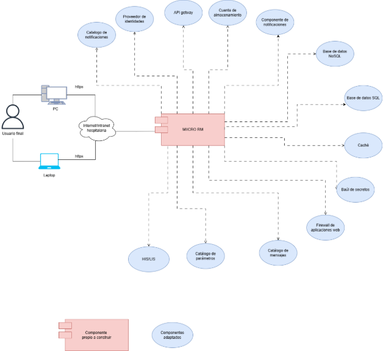
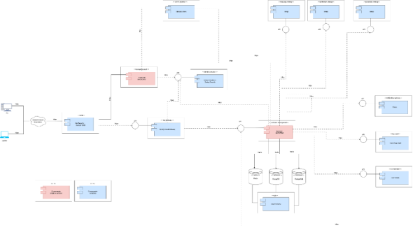

Documento de Arquitectura de Software (DAS)

**Proyecto**

<MICRORM>

**Arquitectos**

<Dany Alexander Cardona Gómez>

# Control de cambios y revisiones

|**Versión**|**Fecha**|**Tipo**|**Descripción**|**Autor**|
| - | - | - | - | - |
|**1**|19/05/2026|Creación|Versión inicial del documento|Dany Alexander Cardona Gómez|

# Contenido
[Control de cambios y revisiones	2](#_toc230127283)

[1.	Propósito del proyecto	9](#_toc230127284)

[2.	Motivadores de la arquitectura	9](#_toc230127285)

[2.1	Restricciones técnicas	10](#_toc230127286)

[2.2	Restricciones de negocio	10](#_toc230127287)

[2.3	Atributos de calidad	10](#_toc230127288)

[2.3.1	Atributo calidad 1: Usabilidad.	10](#_toc230127289)

[2.3.1.1	Característica 1: CAR-USA-0002 Prevención y recuperación de errores.	10](#_toc230127290)

[2.3.1.1.1	Escenario de calidad 1: ESC-CAL-USA-0006 Confirmación de registro de muestra exitoso con resumen visible.	10](#_toc230127291)

[2.3.1.1.2	Escenario de calidad 2 CAR-USA-0003 Retroalimentación al usuario.	10](#_toc230127292)

[2.3.1.1.3	Escenario de calidad 3 ESC-CAL-USA-0010 Alerta de contaminación por tres o más morfotipos en urocultivo.	10](#_toc230127293)

[2.3.1.1.4 Escenario de calidad 4: CAR-USA-0006 Eficiencia de uso	10](#_toc230127294)

[2.3.1.1.5 Escenario de calidad 5: ESC-CAL-USA-0021 Actualización exitosa del estado de muestra de recibida a en análisis.	10](#_toc230127295)

[2.3.2	Atributo calidad 2: Seguridad.	10](#_toc230127296)

[2.3.2.1	Característica 1: CAR-SEG-0005 Autenticación	10](#_toc230127297)

[2.3.2.1.1	Escenario de calidad 1: ESC-CAL-SEG-0011 Cierre automático de sesión tras 10 minutos de inactividad.	10](#_toc230127298)

[2.3.3	Atributo calidad 3: Fiabilidad.	10](#_toc230127299)

[2.3.3.1	Característica 1: CAR-FIA-0001 Integridad de los datos	10](#_toc230127300)

[2.3.3.1.1 Escenario de calidad 1: ESC-CAL-FIA-0001 Registro exitoso de muestra con código único generado automáticamente	10](#_toc230127301)

[2.3.3.2 Característica 2: CAR-FIA-0003 Integridad de los datos.	10](#_toc230127302)

[2.3.3.2.1 Escenario de calidad 1: ESC-CAL-FIA-0005 Bloqueo de modificación de muestra cerrada con mensaje informativo.	10](#_toc230127303)

[2.3.3.3 Característica 3: CAR-FIA-0004 Detección de fallos.	10](#_toc230127304)

[2.3.3.3.1 Escenario de calidad 1: ESC-CAL-FIA-0007 Confirmación requerida antes de guardar cambios en coloración de Gram.	10](#_toc230127305)

[2.3.4 Atributo calidad 4: Disponibilidad.	10](#_toc230127306)

[2.3.4.1 Característica 1: CAR-DIS-0003 Recuperación ante fallos.	10](#_toc230127307)

[2.3.4.1.1 Escenario de calidad 1: ESC-CAL-DIS-0006 Preservación de información de seguimiento de incubación ante cierre inesperado.	10](#_toc230127308)

[2.3.5 Atributo calidad 5: Capacidad para ser mantenido.	10](#_toc230127309)

[2.3.5.1 Característica 1:  CAR-CSM-0013 Historial de cambios.	10](#_toc230127310)

[2.3.5.1.1 Escenario de calidad 1: ESC-CAL-CSM-0019 Consulta exitosa del historial completo de actividad de una muestra desde recepción hasta cierre.	10](#_toc230127311)

[2.3.5.2 Característica 2: CAR-CSM-0014 Historial de cambios.	10](#_toc230127312)

[2.3.5.2.1 Escenario de calidad 1: ESC-CAL-CSM-0021 Registro exitoso del tipo de agar y fecha de siembra para cada cultivo de muestra.	10](#_toc230127313)

[2.4	Funcionalidades críticas.	10](#_toc230127314)

[2.4.1 FC-001 Registro de muestras biológicas.	10](#_toc230127315)

[2.4.2 FC-002 Gestión del ciclo de vida de la muestra.	10](#_toc230127316)

[2.4.3 FC-003 Registro de siembra en medios de cultivo.	10](#_toc230127317)

[2.4.4 FC-004 Seguimiento diario de incubación.	10](#_toc230127318)

[2.4.5 FC-005 Detección automática de contaminación en urocultivos.	10](#_toc230127319)

[2.4.6 FC-006 Registro y consulta de resultados microbiológicos.	10](#_toc230127320)

[2.4.7 FC-007 Trazabilidad e historial de auditoría.	10](#_toc230127321)

[2.4.8 FC-008 Autenticación y control de acceso por roles.	10](#_toc230127322)

[2.4.9 FC-009 Generación de reportes del laboratorio.	10](#_toc230127323)

[2.4.10 FC-010 Integración con el HIS/LIS hospitalario.	10](#_toc230127324)

[3.	Tácticas y estrategias.	9](#_toc230127325)

[3.1 Táctica 1: Máquina de estados finitos para el ciclo de vida de muestras.	10](#_toc230127326)

[3.2 Táctica 2: Motor de reglas de dominio en la capa de negocio.	10](#_toc230127327)

[3.3 Táctica 3: Event Sourcing con MongoDB append-only para auditoría.	10](#_toc230127328)

[3.4 Táctica 4: Separación de operaciones de consulta y modificación de datos.	10](#_toc230127329)

[3.5 Táctica 5: Autoguardado periódico durante el seguimiento de incubación.	10](#_toc230127330)

[3.6 Táctica 6: Cierre automático de sesión por inactividad.	10](#_toc230127331)

[3.7 Táctica 7: Control de acceso basado en roles.	10](#_toc230127332)

[3.8 Táctica 8: Arquitectura en capas con separación estricta de responsabilidades.	10](#_toc230127333)

[3.9 Táctica 9: Integración con HIS/LIS mediante HL7 FHIR.	10](#_toc230127334)

[3.10 Táctica 10: Gestión de parámetros del dominio mediante Strapi.	10](#_toc230127335)

[4.	Modelo de contexto	9](#_toc230127336)

[4.1 Componentes.	10](#_toc230127337)

[4.2 Modelo de contexto esquema.	10](#_toc230127338)

[5.	Arquetipo de solución/referencia	9](#_toc230127339)

[5.1 Componentes.	10](#_toc230127340)

[5.1.1 Componente 1: Dispositivos de acceso: PC y Laptop.	10](#_toc230127341)

[5.1.2 Componente 2: Canal de comunicación: Internet / Intranet hospitalaria.	10](#_toc230127342)

[5.1.3 Componente 3: Componente propio: FrontEnd MICRO RM	10](#_toc230127343)

[5.1.4 Componente 4: Componente propio: Backend MICRO RM.	10](#_toc230127344)

[5.1.5 Componente 5: Componente adaptado: Firewall de aplicaciones web.	10](#_toc230127345)

[5.1.6 Componente 6: Componente adaptado: API Gateway.	10](#_toc230127346)

[5.1.7 Componente 7: Componente adaptado: Proveedor de identidades.	10](#_toc230127347)

[5.1.8 Componente 8: Componente adaptado: HIS/LIS.	10](#_toc230127348)

[5.1.9 Componente 9: Componente adaptado: Catálogo de notificaciones.	10](#_toc230127349)

[5.1.10 Componente 10: Componente adaptado: Catálogo de plantillas.	10](#_toc230127350)

[5.1.11 Componente 11: Componente adaptado: Catálogo de parámetros.	10](#_toc230127351)

[5.1.12 Componente 12: Componente adaptado: Baúl de secretos.	10](#_toc230127352)

[5.1.13 Componente 13: Componente adaptado: Base de datos relacional.	10](#_toc230127353)

[5.1.14 Componente 14: Componente adaptado: Caché.	10](#_toc230127354)

[5.1.16 Componente 16: Componente adaptado: Change Data Capture.	10](#_toc230127355)

[5.1.17 Componente 17: Componente adaptado: CI/CD Pipelinee.	10](#_toc230127356)

[5.1.18 Componente 18: Componente adaptado: Base de datos no relacional.	10](#_toc230127357)

[5.1.19 Componente 15: Componente adaptado: Servicio de notificaciones.	10](#_toc230127358)

[5.3 Arquetipo de solución/referencia diagrama	10](#_toc230127359)

[6.	Arquitectura de solución/referencia	9](#_toc230127360)

[6.1 Arquitectura de solución/referencia diagrama	10](#_toc230127361)

[7.	Línea base arquitectónica	9](#_toc230127362)

[7.1	Línea base arquitectónica de componentes	10](#_toc230127363)

[7.1.1	Componente 1: Font End MicroRM.	10](#_toc230127364)

[7.1.2	Componente 2: Back End MicroRM.	10](#_toc230127365)

[7.2	Estilos y patrones arquitectónicos adoptados	10](#_toc230127366)

[7.2.1	Estilo arquitectónico 1:	10](#_toc230127367)

[7.2.1.1	Nombre	10](#_toc230127368)

[7.2.1.2	Problema	10](#_toc230127369)

[7.2.1.3	Solución	10](#_toc230127370)

[7.2.2	Estilo arquitectónico 2:	10](#_toc230127371)

[7.2.2.1	Nombre	10](#_toc230127372)

[7.2.2.2	Problema	10](#_toc230127373)

[7.2.2.3	Solución	10](#_toc230127374)

[7.2.3	Estilo arquitectónico 3:	10](#_toc230127375)

[7.2.3.1	Nombre	10](#_toc230127376)

[7.2.3.2	Problema	10](#_toc230127377)

[7.2.3.3	Solución	10](#_toc230127378)

[7.2.4	Estilo arquitectónico 4:	10](#_toc230127379)

[7.2.4.1	Nombre	10](#_toc230127380)

[7.2.4.2	Problema	10](#_toc230127381)

[7.2.4.3	Solución	10](#_toc230127382)

[7.2.5	Estilo arquitectónico 5:	10](#_toc230127383)

[7.2.5.1	Nombre	10](#_toc230127384)

[7.2.5.2	Problema	10](#_toc230127385)

[7.2.5.3	Solución	10](#_toc230127386)

[7.2.6	Estilo arquitectónico 4:	10](#_toc230127387)

[7.2.6.1	Nombre	10](#_toc230127388)

[7.2.6.2	Problema	10](#_toc230127389)

[7.2.6.3	Solución	10](#_toc230127390)

[7.2.7	Estilo arquitectónico 4:	10](#_toc230127391)

[7.2.7.1	Nombre	10](#_toc230127392)

[7.2.7.2	Problema	10](#_toc230127393)

[7.2.7.3	Solución	10](#_toc230127394)

[7.2.8	Estilo arquitectónico 4:	10](#_toc230127395)

[7.2.8.1	Nombre	10](#_toc230127396)

[7.2.8.2	Problema	10](#_toc230127397)

[7.2.8.3	Solución	10](#_toc230127398)

[7.2.9	Estilo arquitectónico 4:	10](#_toc230127399)

[7.2.9.1	Nombre	10](#_toc230127400)

[7.2.9.2	Problema	10](#_toc230127401)

[7.2.9.3	Solución	10](#_toc230127402)

[7.2.10	Estilo arquitectónico 4:	10](#_toc230127403)

[7.2.10.1	Nombre	10](#_toc230127404)

[7.2.10.2	Problema	10](#_toc230127405)

[7.2.10.3	Solución	10](#_toc230127406)

[7.2.11	Estilo arquitectónico 4:	10](#_toc230127407)

[7.2.11.1	Nombre	10](#_toc230127408)

[7.2.11.2	Problema	10](#_toc230127409)

[7.2.11.3	Solución	10](#_toc230127410)

[7.2.12	Estilo arquitectónico 4:	10](#_toc230127411)

[7.2.12.1	Nombre	10](#_toc230127412)

[7.2.12.2	Problema	10](#_toc230127413)

[7.2.12.3	Solución	10](#_toc230127414)

[8.	Justificación alternativa de solución	9](#_toc230127415)

[8.1	Ventajas	10](#_toc230127416)

[8.2	Desventajas	10](#_toc230127417)

[9.	Vistas de arquitectura del sistema	9](#_toc230127418)

[9.1	Vista Funcional/Vista de Escenarios/Vista de Casos de Uso	9](#_toc230127419)

[9.2	Vista Lógica	9](#_toc230127420)

[9.3	Vista de Despliegue/Vista de Desarrollo/Vista de Implementación	9](#_toc230127421)

[9.3.1	Diagrama de componentes	9](#_toc230127422)

[9.3.1.1	Componente 1	9](#_toc230127423)

[9.3.1.1.1	Diagrama	10](#_toc230127424)

[9.3.1.1.2	Documentación	10](#_toc230127425)

[9.3.1.2	Componente 2	10](#_toc230127426)

[9.3.1.2.1	Diagrama	10](#_toc230127427)

[9.3.1.2.2	Documentación	10](#_toc230127428)

[9.3.1.3	Componente N	10](#_toc230127429)

[9.3.1.3.1	Diagrama	10](#_toc230127430)

[9.3.1.3.2	Documentación	10](#_toc230127431)

[9.3.2	Diagrama de paquetes	10](#_toc230127432)

[9.3.2.1	Componente 1	10](#_toc230127433)

[9.3.2.1.1	Diagrama	10](#_toc230127434)

[9.3.2.1.2	Documentación	10](#_toc230127435)

[9.3.2.2	Componente 2	10](#_toc230127436)

[9.3.2.2.1	Diagrama	10](#_toc230127437)

[9.3.2.2.2	Documentación	11](#_toc230127438)

[9.3.2.3	Componente N	11](#_toc230127439)

[9.3.2.3.1	Diagrama	11](#_toc230127440)

[9.3.2.3.2	Documentación	11](#_toc230127441)

[9.4	Vista de Procesos	11](#_toc230127442)

[9.4.1	Diagrama de secuencia	11](#_toc230127443)

[9.4.1.1	Componente 1	11](#_toc230127444)

[9.4.1.1.1	Diagrama	11](#_toc230127445)

[9.4.1.1.2	Documentación	11](#_toc230127446)

[9.4.1.2	Componente 2	11](#_toc230127447)

[9.4.1.2.1	Diagrama	11](#_toc230127448)

[9.4.1.2.2	Documentación	11](#_toc230127449)

[9.4.1.3	Componente N	11](#_toc230127450)

[9.4.1.3.1	Diagrama	11](#_toc230127451)

[9.4.1.3.2	Documentación	12](#_toc230127452)

[9.4.2	Diagrama de colaboración	12](#_toc230127453)

[9.4.2.1	Componente 1	12](#_toc230127454)

[9.4.2.1.1	Diagrama	12](#_toc230127455)

[9.4.2.1.2	Documentación	12](#_toc230127456)

[9.4.2.2	Componente 2	12](#_toc230127457)

[9.4.2.2.1	Diagrama	12](#_toc230127458)

[9.4.2.2.2	Documentación	12](#_toc230127459)

[9.4.2.3	Componente N	12](#_toc230127460)

[9.4.2.3.1	Diagrama	12](#_toc230127461)

[9.4.2.3.2	Documentación	12](#_toc230127462)

[9.5	Vista Física/Vista de Implantación	12](#_toc230127463)

[9.5.1	Diagrama de despliegue	12](#_toc230127464)

[9.5.1.1	Diagrama	12](#_toc230127465)

[9.5.1.2	Documentación	13](#_toc230127466)

1. # Propósito del proyecto
<Defina en términos comprensibles y de forma clara cuál es la visión del proyecto.>
1. # Motivadores de la arquitectura
<Los motivadores de la arquitectura son los factores o las necesidades funcionales de calidad, técnicas y de negocio que orientan, condicionan y justifican las decisiones de diseño de un sistema.\
Estos motivadores definen el rumbo del proyecto al delimitar su alcance, establecer las prioridades e identificar las restricciones que resultan no negociables para alcanzar la solución

Cada motivador influye directamente en una o varias decisiones de diseño, ya que determina aspectos como la estructura del sistema, las tecnologías seleccionadas, los patrones de diseño, la seguridad, el rendimiento, la escalabilidad y la mantenibilidad.>
1. ## Restricciones técnicas
<Las restricciones técnicas son condiciones del entorno o del contexto del proyecto que el equipo de desarrollo no puede cambiar y que, por tanto, afectan directamente las decisiones de diseño. No son preferencias ni sugerencias: son límites reales que ya existen antes de escribir la primera línea de código. A diferencia de los requerimientos funcionales, que describen lo que el sistema debe hacer, las restricciones describen dentro de qué márgenes se puede trabajar.

Si una restricción dice que el sistema debe correr en un servidor Windows on-premise sin acceso a servicios cloud, el equipo no puede planear despliegues en AWS ni usar servicios gestionados de terceros. Eso afecta el cronograma, las herramientas que se pueden usar y cómo se organiza el trabajo; cada restricción técnica descarta o favorece ciertas decisiones arquitectónicas y en ese sentido, las restricciones no son un problema: son una guía que ayuda a tomar decisiones justificadas.>
1. ## Restricciones de negocio
<Las restricciones de negocio son condiciones externas al equipo de desarrollo, impuestas por el contexto organizacional, normativo o regulatorio del proyecto, que determinan qué puede y qué no puede hacer el sistema desde una perspectiva no técnica. A diferencia de las restricciones técnicas, que provienen del entorno tecnológico, las restricciones de negocio vienen de leyes, normas del sector, políticas institucionales o acuerdos que el sistema debe respetar obligatoriamente.

Las restricciones de negocio dan forma al alcance del proyecto antes de que se tome cualquier decisión técnica, cada restricción de negocio exige que la arquitectura responda con una solución concreta. Si la normativa exige confidencialidad de datos de pacientes, el diseño debe incorporar cifrado, control de acceso basado en roles y registros de auditoría. Si el sistema debe operar en un entorno hospitalario regulado, la arquitectura no puede depender de servicios externos no certificados. Así, las restricciones de negocio no son un obstáculo al diseño — son parte de los insumos que lo construyen.

|#|Restricción|Descripción|Justificación|
| - | - | - | - |
|RN-01|Cumplimiento de la Ley 1581 de 2012|El sistema maneja datos sensibles de pacientes, por lo que debe garantizar su confidencialidad, uso autorizado y posibilidad de corrección según lo exige la ley colombiana de habeas data.|Al tratar información clínica identificable de personas naturales, el sistema está sujeto a esta ley de forma obligatoria. Su incumplimiento representa un riesgo legal para la institución.|
|RN-02|Cumplimiento de la norma ISO 15189|Esta norma internacional define los requisitos de calidad y competencia para laboratorios clínicos, incluyendo la trazabilidad de muestras, la validación de resultados y el control de registros.|MicroRM está diseñado para operar en un laboratorio de microbiología clínica. Para que el sistema sea válido en ese entorno debe alinearse con los estándares que rigen la actividad del laboratorio.|
|RN-03|Contexto de uso hospitalario con infraestructura preexistente|El sistema debe integrarse con la infraestructura tecnológica ya instalada en el hospital, incluyendo el directorio activo para gestión de usuarios y el sistema de información hospitalario.|No es viable ni justificable reemplazar sistemas institucionales que ya funcionan. El sistema debe adaptarse al entorno, no al contrario.|
|RN-04|Proyecto de carácter académico con alcance delimitado|MicroRM es un proyecto desarrollado en el marco de un curso de arquitectura de software, por lo que su alcance está acotado a lo que es viable demostrar y sustentar académicamente.|El contexto académico impone limitaciones reales de tiempo, recursos y complejidad que deben reflejarse en las decisiones de diseño para que el proyecto sea ejecutable y evaluable.|
|RN-05|Sistema diseñado para un único laboratorio|El sistema está pensado para operar en un solo laboratorio clínico, sin necesidad de separar datos o configuraciones entre múltiples instituciones.|El caso de uso del proyecto es específico. Diseñar para multitenencia agregaría complejidad innecesaria que no está justificada en este contexto.|
|RN-06|Operación restringida a usuarios internos del laboratorio|El sistema no está diseñado para acceso externo por parte de pacientes u otras instituciones, sino exclusivamente para el personal del laboratorio con roles definidos.|El flujo de trabajo del laboratorio es interno. No hay interacción directa del paciente con el sistema, lo que reduce la superficie de exposición y refuerza la necesidad de control de acceso estricto por roles.|

\>
1. ## Atributos de calidad
< Los atributos de calidad son características no funcionales que describen cómo debe comportarse el sistema, más allá de lo que debe hacer. Mientras los requerimientos funcionales definen las acciones del sistema. En la práctica, son los criterios que permiten evaluar si una arquitectura es buena o no para un contexto específico.

Estos ayudan a priorizar esfuerzos durante el desarrollo. No todos tienen el mismo peso en todos los proyectos: en MicroRM, la fiabilidad y la seguridad son más críticas que el rendimiento, porque un resultado clínico incorrecto o un acceso no autorizado tienen consecuencias directas sobre la salud del paciente. Identificar y priorizar estos atributos desde el inicio evita que el equipo invierta tiempo en optimizaciones poco relevantes y enfoque los recursos donde realmente importa.

Cada atributo de calidad se traduce en decisiones de diseño concretas. Si el sistema debe ser seguro, la arquitectura incorpora cifrado, control de acceso por roles y cierre automático de sesión. Si debe ser fiable, se diseña con trazabilidad de eventos y máquina de estados para el ciclo de vida de muestras. Los atributos de calidad son, en este sentido es el puente entre las necesidades del negocio y las decisiones técnicas del arquitecto>
1. ## Atributo calidad 1: Usabilidad.
< La usabilidad es el atributo de calidad que determina qué tan fácil y eficiente resulta para los usuarios interactuar con el sistema para cumplir sus tareas. En MicroRM, este atributo es especialmente importante porque el personal del laboratorio (auxiliares de enfermería, bacteriólogos y coordinadores) no necesariamente tiene formación técnica avanzada, y cualquier dificultad en el uso del sistema puede traducirse en errores en el registro de muestras o resultados clínicos. Esto le apunta al desarrollo del proyecto priorizando la construcción de interfaces intuitivas, formularios bien estructurados y retroalimentación clara desde las primeras versiones del sistema. En cuanto al diseño, la usabilidad orienta decisiones como la validación automática de datos en la capa de negocio, la implementación de un motor de reglas que guíe al usuario dentro de las opciones válidas. >
1. ## ` `Característica 1: CAR-USA-0002 Prevención y recuperación de errores.
< Esta característica establece que el sistema debe ofrecer formularios claros, organizados y con validaciones automáticas que reduzcan la posibilidad de que el usuario cometa errores al registrar una muestra. Le apunta al desarrollo del proyecto porque implica dedicar esfuerzo desde el inicio al diseño de los formularios de registro, definiendo qué campos son obligatorios, qué formatos son válidos y qué listas de selección deben estar predefinidas. En términos de diseño, esta característica justifica el uso de validaciones tanto en el frontend como en el backend, asegurando que ningún dato inconsistente llegue a persistirse en la base de datos.>
1. ## Escenario de calidad 1: ESC-CAL-USA-0006 Confirmación de registro de muestra exitoso con resumen visible.
< Este escenario describe la situación en la que una auxiliar de enfermería completa correctamente el formulario de registro de una muestra y el sistema responde mostrando una pantalla de confirmación con un resumen de los datos guardados y un mensaje de éxito claro. Le apunta al desarrollo porque indica que no basta con guardar los datos; el sistema también debe comunicarle al usuario que la operación fue exitosa y qué fue lo que se registró. En el diseño, este escenario justifica que la capa de presentación incluya un componente de confirmación luego de guardado que muestre el código asignado, el nombre del paciente, el tipo de cultivo y la fecha de registro, todo ello en menos de 3 segundos.>
1. ## Escenario de calidad 2 CAR-USA-0003 Retroalimentación al usuario.
< Esta característica establece que el sistema debe validar los datos ingresados y mostrar mensajes de error claros y comprensibles cuando detecte inconsistencias. Le apunta al desarrollo del proyecto porque implica diseñar e implementar un conjunto de mensajes de error específicos para cada tipo de validación, lo cual requiere trabajo tanto en la lógica de validación del backend como en los componentes de interfaz del frontend. En el diseño, esta característica refuerza la necesidad de un motor de reglas en la capa de negocio que pueda evaluar condiciones del dominio microbiológico y comunicar sus resultados de forma comprensible al usuario, no como un error técnico sino como una guía de acción. >
1. ## Escenario de calidad 3 ESC-CAL-USA-0010 Alerta de contaminación por tres o más morfotipos en urocultivo.
< Este escenario describe la situación en la que un bacteriólogo registra un tercer morfotipo bacteriano en un urocultivo y el sistema detecta automáticamente la condición de contaminación, desplegando una alerta visible antes de que el usuario guarde el cambio. Le apunta al desarrollo porque es una regla del dominio microbiológico que debe estar codificada explícitamente en la lógica de negocio del sistema y no puede depender del criterio manual del usuario en cada caso. En el diseño, este escenario justifica la implementación del patrón motor de reglas en la capa de negocio, específicamente para evaluar la condición de contaminación en urocultivos con tres o más morfotipos, y la comunicación de ese resultado al frontend mediante un mensaje de alerta claro antes de permitir el guardado.>
## 2.3.1.1.4 Escenario de calidad 4: CAR-USA-0006 Eficiencia de uso
< Esta característica establece que el sistema debe permitir actualizar el estado de una muestra de manera fácil y clara, sin pasos innecesarios. Le apunta al desarrollo del proyecto porque implica que la transición entre estados del ciclo de vida de una muestra debe ser una operación accesible y directa desde la interfaz, sin requerir navegación compleja. En el diseño, esta característica refuerza la implementación de una máquina de estados finitos en la capa de negocio que controle qué transiciones son válidas, y una interfaz que las exponga de forma explícita y comprensible para el bacteriólogo. >
## 2.3.1.1.5 Escenario de calidad 5: ESC-CAL-USA-0021 Actualización exitosa del estado de muestra de recibida a en análisis.
< Este escenario describe la situación en la que un bacteriólogo selecciona una muestra en estado "Recibida", elige el nuevo estado "En análisis" y ejecuta la actualización, esperando que el cambio se refleje de inmediato tanto en el detalle como en el listado general. Le apunta al desarrollo porque establece un tiempo de respuesta concreto —menos de 2 segundos— y la necesidad de que el cambio sea visible en tiempo real en la interfaz. En el diseño, este escenario justifica el uso de la máquina de estados para validar la transición antes de persistirla, y la actualización reactiva del estado en la SPA de Vue 3 sin necesidad de recargar la página.>

1. ## Atributo calidad 2: Seguridad.
<La seguridad es el atributo de calidad que garantiza que el sistema proteja la información, controle el acceso de los usuarios y registre las acciones realizadas dentro del aplicativo. En MicroRM este atributo es crítico porque el sistema maneja datos clínicos de pacientes, los cuales están protegidos por la Ley 1581 de 2012 y deben cumplir con los requisitos de control de acceso establecidos en la norma ISO 15189. Le apunta al desarrollo del proyecto porque obliga a diseñar e implementar desde el principio mecanismos de autenticación, autorización por roles y cierre de sesión automático, sin dejarlos como elementos opcionales para fases posteriores. >
1. ## ` `Característica 1: CAR-SEG-0005 Autenticación
<Esta característica establece que el sistema debe cerrar automáticamente las sesiones de los usuarios después de 10 minutos de inactividad, como medida de protección ante accesos no autorizados desde estaciones de trabajo desatendidas. Le apunta al desarrollo del proyecto porque implica implementar un mecanismo de monitoreo de actividad del usuario que opere de forma transparente en segundo plano, sin afectar el flujo normal de trabajo cuando el usuario sí está activo. En el diseño, esta característica justifica el uso de un hilo programado en Spring Boot que evalúe periódicamente el tiempo de inactividad de cada sesión activa y ejecute el cierre cuando se alcanza el umbral configurado.>
1. ## Escenario de calidad 1: ESC-CAL-SEG-0011 Cierre automático de sesión tras 10 minutos de inactividad.
<Este escenario describe la situación en la que un usuario autenticado no realiza ninguna interacción con el sistema durante 10 minutos consecutivos. Ante esto, el sistema debe mostrar una advertencia con al menos 60 segundos de anticipación y luego ejecutar el cierre automático de la sesión, preservando los datos en proceso mediante autoguardado. Le apunta al desarrollo porque establece un comportamiento no funcional que debe estar activo en todo momento durante la operación del sistema, lo que requiere implementación cuidadosa para no interferir con las operaciones activas del usuario. En el diseño, este escenario se resuelve con un scheduled thread en Spring Security que monitorea el tiempo de inactividad y una notificación desde el backend al frontend vía WebSocket que alerta al usuario antes del cierre.>
1. ## Atributo calidad 3: Fiabilidad.
<La fiabilidad es el atributo de calidad que garantiza que el sistema opere correctamente, que los datos almacenados sean íntegros y consistentes, y que el sistema sea capaz de detectar y manejar situaciones anómalas sin comprometer la información. En MicroRM este atributo es el más crítico desde la perspectiva clínica, porque un dato incorrecto o inconsistente en el resultado de un cultivo puede derivar en una decisión médica equivocada. Le apunta al desarrollo priorizando la implementación de validaciones robustas, controles de integridad en la base de datos y mecanismos de detección de errores desde las etapas tempranas del proyecto. En el diseño, la fiabilidad justifica el uso de transacciones ACID con PostgreSQL, el patrón de máquina de estados para controlar el ciclo de vida de las muestras y Event Sourcing con MongoDB para registrar de forma inmutable cada cambio sobre los datos clínicos.>
1. ## Característica 1: CAR-FIA-0001 Integridad de los datos
< Establece que el sistema debe garantizar que cada muestra registrada tenga un código único e irrepetible, evitando duplicidades que puedan generar confusión en el proceso de análisis. Le apunta al desarrollo porque implica implementar un mecanismo de generación de identificadores únicos que opere de forma automática en el momento del registro, sin depender del usuario. En el diseño, esta característica justifica el uso de una estrategia de generación de códigos en la capa de negocio, validados contra la base de datos antes de confirmar el registro y respaldados por restricciones de unicidad en PostgreSQL como segunda línea de defensa. >
## 2.3.3.1.1 Escenario de calidad 1: ESC-CAL-FIA-0001 Registro exitoso de muestra con código único generado automáticamente
< Describe la situación en la que una auxiliar de enfermería completa el formulario de registro de una muestra y el sistema, al guardar, genera automáticamente un código único que no coincide con ningún registro previo y lo muestra en la confirmación. Le apunta al desarrollo porque establece que la generación del código es responsabilidad del sistema y no del usuario, lo que implica diseñar esa lógica en el backend desde el inicio. En el diseño, este escenario se resuelve en la capa de negocio de Spring Boot, donde se genera el identificador antes de la persistencia y se verifica su unicidad dentro de una transacción que garantice que el registro completo sea exitoso o se revierta por completo en caso de error. >
## 2.3.3.2 Característica 2: CAR-FIA-0003 Integridad de los datos.
< Establece que el sistema debe impedir cualquier modificación sobre una muestra que ya ha sido cerrada, protegiendo la integridad del resultado clínico final. Le apunta al desarrollo porque implica que el control del estado de la muestra no puede estar únicamente en la interfaz; debe estar reforzado también en la capa de negocio y en la base de datos, de forma que ninguna vía de acceso pueda saltarse esa restricción. En el diseño, esta característica refuerza el uso de la máquina de estados finitos, que por definición impide transiciones no válidas, y la validación en los servicios de Spring Boot que rechacen cualquier operación de escritura sobre muestras en estado "Finalizada". >
## 2.3.3.2.1 Escenario de calidad 1: ESC-CAL-FIA-0005 Bloqueo de modificación de muestra cerrada con mensaje informativo.
< Describe la situación en la que un bacteriólogo o auxiliar intenta editar los datos de una muestra cuyo estado es "Finalizada". El sistema debe mostrar el registro en modo solo lectura y desplegar un mensaje que explique claramente por qué no es posible la modificación. Le apunta al desarrollo porque establece que la restricción debe comunicarse al usuario de forma comprensible, no como un error técnico. En el diseño, este escenario se resuelve combinando la validación de estado en el servicio de Spring Boot —que rechaza la operación antes de intentar cualquier cambio— con un componente de interfaz en Vue que detecta el estado "Finalizada", deshabilita los campos del formulario y muestra el mensaje informativo correspondiente. >
## 2.3.3.3 Característica 3: CAR-FIA-0004 Detección de fallos.
< En esta se establece que el sistema debe validar la información ingresada antes de almacenarla y solicitar confirmación explícita del usuario antes de guardar cambios en operaciones de alto impacto clínico, como la modificación de la coloración de Gram. Le apunta al desarrollo porque implica identificar desde el análisis cuáles son esas operaciones críticas y diseñar un flujo de confirmación específico para ellas, lo que representa un caso especial dentro del proceso de registro. En el diseño, esta característica justifica la implementación de un mecanismo de doble confirmación en la interfaz para campos críticos identificados en el dominio microbiológico, antes de que la solicitud de guardado llegue al backend. >
## 2.3.3.3.1 Escenario de calidad 1: ESC-CAL-FIA-0007 Confirmación requerida antes de guardar cambios en coloración de Gram.
< Este escenario describe la situación en la que un bacteriólogo modifica el valor del campo de coloración de Gram en el seguimiento de incubación. Antes de almacenar el cambio, el sistema debe desplegar una ventana de confirmación que muestre el valor anterior y el nuevo, solicitando que el bacteriólogo confirme explícitamente la acción. Le apunta al desarrollo porque establece que este campo específico requiere un tratamiento diferenciado dentro del flujo de registro, lo cual impacta tanto la lógica del formulario como la del servicio que procesa el guardado. En el diseño, este escenario se resuelve con un interceptor en la capa de presentación que detecta cambios en el campo de coloración de Gram y dispara el diálogo de confirmación antes de enviar la solicitud al backend, asegurando que ningún cambio en ese campo se persista sin validación explícita del bacteriólogo. >
## 2.3.4 Atributo calidad 4: Disponibilidad.
< La disponibilidad es el atributo de calidad que garantiza que el sistema permanezca operativo y accesible durante la jornada laboral del laboratorio, y que sea capaz de recuperarse ante fallos sin pérdida de información. En MicroRM este atributo es relevante porque el laboratorio opera en un ambiente clínico donde la interrupción del sistema puede retrasar el análisis de muestras y afectar la atención al paciente. Le apunta al desarrollo del proyecto priorizando la implementación de mecanismos de autoguardado y recuperación desde las primeras versiones funcionales. En el diseño, la disponibilidad justifica el uso de transacciones con rollback en Spring Boot, el autoguardado periódico durante el registro de seguimientos de incubación, y una configuración de PostgreSQL que garantice la durabilidad de los datos ante fallos inesperados. >
## 2.3.4.1 Característica 1: CAR-DIS-0003 Recuperación ante fallos.
< Establece que el sistema debe proteger la información registrada, evitando pérdida de datos durante procesos de registro, actualización o ante posibles errores del sistema. Le apunta al desarrollo porque implica diseñar desde el inicio un mecanismo de autoguardado periódico para las operaciones de larga duración, como el registro del seguimiento diario de incubación, que puede involucrar múltiples campos ingresados en diferentes momentos. En el diseño, esta característica justifica la implementación de un proceso de autoguardado automático en segundo plano que persista de forma parcial los datos en proceso, de manera que un fallo inesperado no implique la pérdida total del trabajo realizado por el bacteriólogo.>
## 2.3.4.1.1 Escenario de calidad 1: ESC-CAL-DIS-0006 Preservación de información de seguimiento de incubación ante cierre inesperado.
< Este escenario describe la situación en la que el aplicativo se cierra de forma inesperada mientras el bacteriólogo está registrando datos del seguimiento diario de incubación. Al reconectarse, el sistema debe recuperar y presentar los datos guardados hasta el último punto de autoguardado, permitiendo al bacteriólogo continuar desde donde estaba. Le apunta al desarrollo porque establece una garantía concreta: la pérdida máxima de datos debe ser de 60 segundos, lo que implica configurar el intervalo de autoguardado en ese valor. En el diseño, este escenario se resuelve con un scheduled task en Spring Boot que persiste el estado parcial del seguimiento de forma periódica, aprovechando las garantías de durabilidad de PostgreSQL para asegurar que esos datos no se pierdan ante reinicios inesperados del sistema.>
## 2.3.5 Atributo calidad 5: Capacidad para ser mantenido.
<La capacidad para ser mantenido es el atributo de calidad que determina qué tan fácil resulta modificar, corregir o extender el sistema a lo largo del tiempo. En MicroRM este atributo es especialmente relevante dado que el sistema es desarrollado por un solo estudiante que también actúa como analista y arquitecto, por lo que la deuda técnica acumulada tiene un impacto directo y visible sobre la velocidad de desarrollo. Le apunta al proyecto priorizando desde el diseño inicial la separación de responsabilidades entre módulos, la documentación del código y la trazabilidad de los cambios sobre las muestras.>
## 2.3.5.1 Característica 1:  CAR-CSM-0013 Historial de cambios.
<Establece que el sistema debe registrar la fecha, hora y usuario responsable en cada modificación de estado o datos de una muestra, garantizando la trazabilidad completa del proceso microbiológico. Le apunta al desarrollo porque implica que cada operación de escritura sobre una muestra debe producir automáticamente un registro de auditoría, lo cual debe estar incorporado en la lógica de la capa de negocio desde el principio y no agregarse como un componente posterior. En el diseño, esta característica justifica el uso de Event Sourcing con MongoDB en modo append-only, donde cada cambio genera un evento inmutable que queda registrado con su autor y marca de tiempo, cumpliendo además con los requisitos de trazabilidad exigidos por la ISO 15189 y la Ley 1581.>
## 2.3.5.1.1 Escenario de calidad 1: ESC-CAL-CSM-0019 Consulta exitosa del historial completo de actividad de una muestra desde recepción hasta cierre.
<Este escenario describe la situación en la que un bacteriólogo o coordinador accede al historial de una muestra y el sistema despliega cronológicamente todos los eventos registrados: registro inicial, clasificación, siembra en agares, seguimientos diarios de incubación y cierre con el microorganismo aislado. Cada evento debe mostrar la fecha, hora y usuario responsable. Le apunta al desarrollo porque establece que la trazabilidad no es solo un requerimiento de almacenamiento sino también de consulta, lo que implica construir tanto el mecanismo de registro como una vista de historial comprensible para el usuario clínico. En el diseño, este escenario se resuelve mediante una consulta CQRS sobre la colección de eventos en MongoDB, que recupera y ordena cronológicamente todos los eventos asociados a una muestra, presentándolos en la interfaz como una línea de tiempo en menos de 5 segundos.>
## 2.3.5.2 Característica 2: CAR-CSM-0014 Historial de cambios.
< Esta característica establece que el sistema debe asignar un identificador único a cada muestra y registrar el tipo de agar utilizado con su fecha de siembra, permitiendo reconstruir completamente el proceso de cultivo microbiológico en cualquier momento. Le apunta al desarrollo porque implica que la estructura de datos de siembra debe contemplar desde el inicio el almacenamiento del agar y la fecha como campos de trazabilidad obligatorios, no opcionales. En el diseño, esta característica refuerza el modelo de datos relacional en PostgreSQL para la siembra —con su referencia al catálogo de agares gestionado en Strapi— y la generación del evento de siembra en el registro de auditoría de MongoDB cada vez que se registra un nuevo cultivo. >
## 2.3.5.2.1 Escenario de calidad 1: ESC-CAL-CSM-0021 Registro exitoso del tipo de agar y fecha de siembra para cada cultivo de muestra.
<Este escenario describe la situación en la que un bacteriólogo selecciona el tipo de agar utilizado y la fecha de siembra desde el formulario de seguimiento y los guarda. El sistema debe asociar esos datos a la muestra, almacenarlos en el historial del proceso de cultivo y garantizar que no puedan modificarse sin autorización explícita. Le apunta al desarrollo porque implica que el catálogo de agares —MacConkey, Sangre, Chocolate, CNA, Schaedler, Sabouraud, Mycosel, Tioglicolato, Lowenstein-Jensen, Thayer-Martin y Cromoagar— debe estar disponible en el sistema como una lista seleccionable desde el formulario, gestionada como parámetro a través de Strapi. En el diseño, este escenario se resuelve persistiendo el registro de siembra en PostgreSQL con referencia al agar seleccionado, y generando simultáneamente un evento de auditoría en MongoDB que preserve de forma inmutable el dato del agar y la fecha de siembra como parte del historial del proceso de cultivo.>
1. ## Funcionalidades críticas.
< Las funcionalidades críticas son aquellas capacidades del sistema sin las cuales el sistema no puede cumplir su propósito principal. No son todas las funcionalidades del sistema, sino las que representan el núcleo de valor del producto: si alguna de ellas falla o no existe, el sistema pierde su razón de ser. Se diferencian de los demás requerimientos funcionales en que su ausencia no es negociable bajo ninguna circunstancia del proyecto.

cada funcionalidad crítica impone decisiones arquitectónicas concretas. El diseño de la arquitectura debe garantizar que estas funcionalidades sean robustas, trazables y seguras por encima de cualquier otra consideración, lo que se refleja directamente en la elección de patrones, tecnologías y estrategias de persistencia.>
## 2.4.1 FC-001 Registro de muestras biológicas.
<El sistema debe permitir registrar una nueva muestra clínica con todos sus datos asociados: paciente, servicio, episodio, orden médica, diagnóstico presuntivo y tipo de cultivo, generando automáticamente un código único de identificación. Esta funcionalidad es crítica porque es la puerta de entrada al sistema; sin ella, ningún proceso posterior (siembra, seguimiento, resultado) puede ejecutarse. Toda la trazabilidad del proceso microbiológico parte de este registro, lo que justifica que la generación del código único y la validación de datos obligatorios estén implementadas en la capa de negocio de Spring Boot desde el inicio del desarrollo.>
## 2.4.2 FC-002 Gestión del ciclo de vida de la muestra.
<El sistema debe controlar las transiciones de estado de cada muestra a lo largo de su proceso (Recibida, En análisis, Finalizada) impidiendo transiciones inválidas y registrando cada cambio con fecha, hora y usuario responsable. Esta funcionalidad es crítica porque el ciclo de vida de una muestra es la columna vertebral del proceso microbiológico: un cambio de estado inválido, como entregar un resultado sin validación bacteriológica previa, compromete directamente la calidad clínica del proceso.>
## 2.4.3 FC-003 Registro de siembra en medios de cultivo.
<El sistema debe permitir registrar para cada muestra el tipo de agar utilizado en la siembra y la fecha en que fue aplicado, seleccionando desde el catálogo de medios disponibles: MacConkey, Sangre, Chocolate, CNA, Schaedler, Sabouraud, Mycosel, Tioglicolato, Lowenstein-Jensen, Thayer-Martin y Cromoagar. Esta funcionalidad es crítica porque la siembra es el primer paso analítico del proceso microbiológico y registrar el agar con su fecha es un requisito de trazabilidad exigido por la ISO 15189. Esto justifica que el catálogo de agares esté gestionado como parámetro configurable a través de Strapi y que cada registro de siembra quede almacenado de forma inmutable en el historial de auditoría de MongoDB.>
## 2.4.4 FC-004 Seguimiento diario de incubación.
<El sistema debe permitir registrar diariamente los hallazgos de incubación de cada cultivo: morfología colonial, coloración de Gram y número de morfotipos identificados, con autoguardado periódico para evitar pérdida de datos ante cierres inesperados. Esta funcionalidad es crítica porque el seguimiento diario es el proceso de mayor duración dentro del análisis microbiológico y el que más riesgo de pérdida de información presenta. Su correcta implementación con autoguardado (con un intervalo máximo de 60 segundos) es indispensable para garantizar la continuidad operativa del bacteriólogo.>
## 2.4.5 FC-005 Detección automática de contaminación en urocultivos.
<El sistema debe detectar automáticamente cuando un urocultivo presenta tres o más morfotipos bacterianos distintos y alertar al bacteriólogo antes de permitir el guardado, indicando que la muestra debe reportarse como contaminada. Esta funcionalidad es crítica porque es una regla del dominio microbiológico que no puede depender del criterio manual del usuario en cada caso: automatizarla protege la calidad del resultado clínico y reduce errores operativos. Esto justifica la implementación del motor de reglas en la capa de negocio, específicamente para evaluar esta condición y comunicar el resultado al frontend mediante una alerta clara antes de permitir el guardado.>
## 2.4.6 FC-006 Registro y consulta de resultados microbiológicos.
<El sistema debe permitir registrar el microorganismo aislado como resultado final del cultivo y bloquear cualquier modificación posterior una vez que la muestra ha sido cerrada, garantizando la inmutabilidad del resultado clínico. Esta funcionalidad es crítica porque el resultado microbiológico es el producto final del proceso del laboratorio y la base de la decisión clínica del médico tratante. Su integridad e inmutabilidad son requisitos tanto clínicos como normativos bajo la ISO 15189, lo que justifica que el bloqueo de modificaciones sobre muestras cerradas esté implementado tanto en la capa de negocio de Spring Boot como en la interfaz de Vue, sin posibilidad de ser saltado por ninguna vía de acceso.>
## 2.4.7 FC-007 Trazabilidad e historial de auditoría.
<El sistema debe registrar de forma inmutable cada acción realizada sobre una muestra (quién la realizó, cuándo y qué cambió) y permitir consultar ese historial completo en cualquier momento desde el registro inicial hasta el cierre. Esta funcionalidad es crítica porque la trazabilidad total del proceso es un requisito explícito de la ISO 15189 y de la Ley 1581: sin este historial, el laboratorio no puede responder ante auditorías externas ni reconstruir el proceso ante un resultado cuestionado.>
## 2.4.8 FC-008 Autenticación y control de acceso por roles.
<El sistema debe autenticar a los usuarios y controlar qué acciones puede ejecutar cada uno según su rol: auxiliar de enfermería, bacteriólogo, coordinador del laboratorio o administrador del sistema. Esta funcionalidad es crítica porque los datos clínicos manejados por el sistema son sensibles por definición legal; sin control de acceso por roles, cualquier usuario podría modificar o consultar información para la que no tiene autorización, violando directamente la Ley 1581 y comprometiendo la integridad del proceso.>
## 2.4.9 FC-009 Generación de reportes del laboratorio.
<El sistema debe permitir al coordinador generar reportes estadísticos del laboratorio filtrables por período, tipo de muestra o microorganismo, exportables en formato PDF, Excel o CSV. Esta funcionalidad es crítica porque los reportes son el mecanismo principal de seguimiento y control del laboratorio: el coordinador los utiliza para identificar patrones de resistencia, evaluar tiempos de respuesta y tomar decisiones de gestión. Sin esta funcionalidad, el sistema resuelve el proceso operativo del laboratorio pero no el analítico.>
## 2.4.10 FC-010 Integración con el HIS/LIS hospitalario.
<El sistema debe recibir las solicitudes de análisis desde el sistema de información hospitalario mediante el estándar HL7 FHIR y devolver los resultados validados al mismo canal, sin requerir doble digitación de datos entre sistemas. Esta funcionalidad es crítica porque el laboratorio no opera de forma aislada: recibe órdenes del HIS y devuelve resultados al médico tratante a través del mismo sistema. Sin esta integración, el personal tendría que digitar manualmente los datos entre sistemas, aumentando el riesgo de error y el tiempo de respuesta clínico.>
1. # Tácticas y estrategias.
<Una táctica es una decisión de diseño concreta que el arquitecto toma para satisfacer un atributo de calidad específico. No es una tecnología ni un framework; es una forma de resolver un problema de diseño. Por ejemplo, "usar caché para mejorar el tiempo de respuesta" o "validar datos en el servidor antes de persistirlos" son tácticas.

Una estrategia, en cambio, es un conjunto de tácticas relacionadas que trabajan juntas para abordar una preocupación arquitectónica más amplia. Si una táctica es una herramienta, la estrategia es el plan que decide cuáles herramientas usar y en qué orden.

La diferencia práctica es de alcance: una táctica resuelve un problema puntual, mientras que una estrategia cubre una dimensión completa del sistema —como la seguridad, la disponibilidad o la mantenibilidad— mediante varias tácticas coordinadas.

Las restricciones del proyecto —tanto técnicas como de negocio— definen el espacio dentro del cual se puede diseñar. Las tácticas y estrategias son la respuesta concreta a ese espacio. Cada restricción o atributo de calidad que no se puede ignorar exige que el arquitecto tome decisiones deliberadas sobre cómo el sistema va a comportarse ante situaciones concretas.

En MicroRM la principal restricción es desarrollador on-premise descartando tácticas que requieren infraestructura distribuida, y la obligación de cumplir con la ISO 15189 exige tácticas de trazabilidad que de otro modo serían opcionales. En ese sentido, las tácticas y estrategias no son decisiones libres: son respuestas obligadas a las fuerzas que actúan sobre el proyecto.>
## 3.1 Táctica 1: Máquina de estados finitos para el ciclo de vida de muestras.
<Implementar una máquina de estados finitos (FSM) en la capa de negocio que controle las transiciones válidas entre los estados de una muestra: Recibida, En análisis, Finalizada, rechazando cualquier transición que no esté definida en el modelo.

El ciclo de vida de una muestra microbiológica tiene un orden estricto que no puede violarse sin comprometer la calidad clínica del proceso. Centralizar ese control en una FSM garantiza que ninguna capa del sistema (ni la interfaz ni una llamada directa al API) pueda producir una transición inválida.

Satisface directamente los escenarios ESC-CAL-FIA-0005 y ESC-CAL-USA-0021, y es la base sobre la que se apoya la FC-002. Reduce la posibilidad de estados inconsistentes en la base de datos y simplifica la lógica de validación distribuida en múltiples puntos del código.>
## 3.2 Táctica 2: Motor de reglas de dominio en la capa de negocio.
<Implementar un motor de reglas dentro de la capa de negocio de Spring Boot que centralice y evalúe las reglas del dominio microbiológico, como la detección de contaminación en urocultivos con tres o más morfotipos o la incompatibilidad entre tipo de muestra y tipo de cultivo.

Las reglas del dominio microbiológico son específicas, numerosas y pueden cambiar con el tiempo. Dispersarlas por toda la lógica de la aplicación aumenta el riesgo de errores y dificulta el mantenimiento. Centralizarlas en un motor de reglas permite evaluarlas de forma consistente y modificarlas en un solo lugar cuando el dominio evolucione.

Satisface los escenarios ESC-CAL-USA-0006, ESC-CAL-USA-0010 y ESC-CAL-USA-0021. Soporta las funcionalidades críticas FC-001, FC-003 y FC-005. Mejora la mantenibilidad del sistema al separar las reglas del dominio de la lógica de control de flujo.>
## 3.3 Táctica 3: Event Sourcing con MongoDB append-only para auditoría.
<Registrar cada cambio relevante sobre una muestra como un evento inmutable en una colección de MongoDB configurada en modo solo escritura. Cada evento incluye el tipo de acción, el identificador de la muestra, el usuario responsable y la marca de tiempo.

La ISO 15189 y la Ley 1581 exigen trazabilidad total sobre los datos clínicos. Un modelo tradicional de auditoría basado en actualizaciones puede ser alterado; Event Sourcing con escrituras append-only garantiza que ningún evento pueda ser modificado o eliminado una vez registrado. MongoDB se eligió sobre PostgreSQL para este fin por su esquema flexible, que permite almacenar eventos de diferentes entidades con estructuras variables sin necesidad de migraciones.

Satisface los escenarios ESC-CAL-CSM-0019 y ESC-CAL-CSM-0021. Es la base técnica de la FC-007. Habilita la reconstrucción completa del proceso de cualquier muestra en cualquier momento, lo que es especialmente relevante ante auditorías externas del laboratorio.>
## 3.4 Táctica 4: Separación de operaciones de consulta y modificación de datos.
<Separar los flujos de lectura y escritura del sistema en dos caminos independientes: los comandos modifican el estado del sistema a través de la capa de negocio, mientras que las consultas (especialmente las de reportes e historial) acceden directamente a modelos de lectura optimizados.

Las consultas de historial y reportes son operaciones intensivas que, si comparten el mismo flujo que las escrituras transaccionales, pueden degradar el rendimiento del sistema durante la jornada laboral del laboratorio. Separar ambos flujos permite optimizar cada uno de forma independiente sin que uno afecte al otro.

Satisface el escenario ESC-CAL-REN-0005 y mejora el rendimiento general del sistema ante consultas concurrentes. Soporta la FC-007 y la FC-009, y sienta las bases para que futuras extensiones del sistema puedan escalar el componente de consultas sin modificar el de escrituras.>
## 3.5 Táctica 5: Autoguardado periódico durante el seguimiento de incubación.
< Implementar un mecanismo de autoguardado automático en segundo plano que persista el estado parcial del formulario de seguimiento de incubación cada 60 segundos, sin requerir acción del usuario y sin interrumpir el flujo de trabajo activo.

El seguimiento diario de incubación es la operación de mayor duración en el flujo del bacteriólogo e involucra múltiples campos que se completan a lo largo de varios minutos. Un cierre inesperado del sistema sin autoguardado implicaría la pérdida total del trabajo en curso, lo cual es inaceptable en un entorno clínico donde el tiempo es un factor crítico.

Satisface directamente el escenario ESC-CAL-DIS-0006 y soporta la FC-004. Reduce el riesgo de pérdida de datos ante fallos del sistema y mejora la percepción de confiabilidad del sistema por parte del bacteriólogo.>
## 3.6 Táctica 6: Cierre automático de sesión por inactividad.
<Implementar un hilo programado en Spring Security que monitoree continuamente el tiempo de inactividad de cada sesión activa y ejecute el cierre automático al alcanzar los 10 minutos, enviando una notificación de advertencia al frontend con al menos 60 segundos de anticipación mediante WebSocket.

Las estaciones de trabajo del laboratorio son compartidas entre varios usuarios y pueden quedar desatendidas durante la jornada. Una sesión abierta sin supervisión representa un riesgo real de acceso no autorizado a datos clínicos sensibles, lo que viola directamente la Ley 1581 y las políticas de seguridad definidas en CAR-SEG-0005.

Satisface el escenario ESC-CAL-SEG-0011 y refuerza la FC-008. Reduce la superficie de exposición del sistema ante accesos no autorizados sin requerir intervención manual del administrador ni cambios en el flujo de trabajo normal del usuario.>
## 3.7 Táctica 7: Control de acceso basado en roles.
<Definir e implementar un modelo de control de acceso basado en roles que asigne permisos diferenciados a cada perfil de usuario (auxiliar de enfermería, bacteriólogo, coordinador del laboratorio y administrador del sistema) controlando qué operaciones puede ejecutar cada rol tanto en el backend como en la interfaz.

El sistema maneja datos clínicos de pacientes que son sensibles por definición legal. Sin un modelo de acceso por roles, cualquier usuario autenticado podría ejecutar operaciones para las que no tiene autorización, como cerrar una muestra sin ser bacteriólogo o consultar resultados sin permiso. Esto violaría la Ley 1581 y comprometería la integridad del proceso clínico.

Satisface los escenarios ESC-CAL-SEG-0011 y ESC-CAL-FIA-0005, y es un componente transversal que impacta todas las funcionalidades críticas del sistema. Se implementa mediante Spring Security con integración LDAP sobre Active Directory, reutilizando la infraestructura de identidad existente en el hospital.>
## 3.8 Táctica 8: Arquitectura en capas con separación estricta de responsabilidades.
<Organizar el backend en cuatro capas bien definidas (Presentación, Integración, Negocio y Datos) donde cada capa solo puede comunicarse con la inmediatamente inferior, y ninguna capa de nivel inferior puede conocer los detalles de una capa superior.

Al ser un proyecto de desarrollo individual con alcance académico, mantener el código organizado y comprensible es tan importante como que funcione correctamente. La arquitectura en capas reduce el acoplamiento entre componentes, facilita las pruebas unitarias y permite modificar una capa sin afectar a las demás, lo cual es esencial para un sistema que debe poder evolucionar durante el semestre.

Es la estrategia arquitectónica base del sistema y el soporte sobre el que se implementan todas las demás tácticas. Mejora la mantenibilidad general, satisface los escenarios CSM-0019 y CSM-0021, y es coherente con la restricción técnica RT-02 de desarrollo en solitario.>
## 3.9 Táctica 9: Integración con HIS/LIS mediante HL7 FHIR.
<Implementar la capa de integración del sistema utilizando HAPI FHIR 7.x como librería de interoperabilidad, definiendo los recursos FHIR necesarios para recibir solicitudes de análisis desde el HIS y enviar resultados validados de vuelta al mismo sistema.

El estándar HL7 FHIR es el protocolo internacional de interoperabilidad en salud y la forma correcta de comunicarse con sistemas hospitalarios sin generar dependencias propietarias. Usar HAPI FHIR garantiza que la integración sea estándar, documentada y mantenible, en lugar de depender de un protocolo ad hoc que solo funcione con el HIS específico del hospital.

Satisface directamente la FC-010 y la restricción de negocio RN-03. Reduce el riesgo de doble digitación de datos entre sistemas y establece un canal de integración que puede extenderse en el futuro a otros sistemas hospitalarios sin rediseñar la arquitectura.>
## 3.10 Táctica 10: Gestión de parámetros del dominio mediante Strapi.
<Gestionar los catálogos de configuración del dominio (medios de cultivo, tipos de muestra, tipos de análisis, parámetros operativos) a través de Strapi como sistema de gestión de contenido headless, accesible por el administrador sin necesidad de modificar el código del sistema.

Los catálogos del laboratorio pueden cambiar con el tiempo: pueden agregarse nuevos tipos de agar, modificarse los estados disponibles o actualizarse los parámetros operativos. Si esos valores están hardcodeados en el sistema, cualquier cambio requiere una nueva versión del software. Externalizarlos en Strapi permite que el administrador los gestione directamente desde una interfaz, sin intervención del desarrollador.

Satisface el escenario ESC-CAL-CSM-0021 y soporta las funcionalidades FC-003 y FC-005. Mejora la mantenibilidad y la capacidad de ser administrado del sistema, y es coherente con la restricción técnica RT-03 de uso exclusivo de herramientas gratuitas.>
1. # Modelo de contexto
<Un modelo de contexto es una representación que muestra el sistema como una caja central y define todo lo que existe a su alrededor: quiénes lo usan, con qué sistemas externos se comunica y qué información intercambia con cada uno. No describe cómo funciona el sistema por dentro y usa un lenguaje ubicuo para que cualquier pueda entenderlo, está enfocado en un público genérico y define dónde está ubicado dentro de su entorno y cuáles son sus fronteras. Su propósito es dejar claro desde el inicio qué es responsabilidad del sistema y qué no, evitando que el proyecto intente abarcar funcionalidades que corresponden a otros sistemas o actores. Le apunta al desarrollo porque delimita el alcance real del trabajo, le apunta al diseño porque cada componente externo identificado representa una integración que la arquitectura debe contemplar.

En el modelo de contexto de MicroRM se identifican dos tipos de componentes: el componente propio a construir, representado con color rojo, y los componentes adoptados del entorno, representados con color azul.>	
## 4.1 Componentes.
<**MicroRM:** Es el sistema a construir. Todo lo que lo rodea son actores o sistemas externos con los que interactúa. Su función es gestionar el proceso completo del laboratorio de microbiología: desde la recepción de muestras hasta la entrega de resultados. Se define como componente propio porque ningún sistema existente en el hospital cubre el proceso microbiológico con el nivel de detalle y trazabilidad que exige la ISO 15189. Por ejemplo, ningún sistema hospitalario genérico contempla la lógica de detección de contaminación en urocultivos con tres o más morfotipos.

**Usuario final:** Es el personal del laboratorio que usa el sistema desde un computador de escritorio o portátil, conectándose a través de la red del hospital. Se incluye porque es quien genera y consume la información que el sistema gestiona; sin su participación el proceso no puede iniciarse ni completarse. Por ejemplo, la auxiliar de enfermería que registra una muestra de orina al momento de recibirla en el laboratorio.

**Internet / Intranet hospitalaria:** Es la red por donde viaja la información entre el usuario y el sistema. Se incluye porque define el medio de comunicación y justifica la necesidad de cifrar la conexión mediante HTTPS para proteger los datos clínicos en tránsito, cumpliendo con la Ley 1581. Por ejemplo, cuando el bacteriólogo guarda el resultado de un cultivo desde su estación de trabajo, esa información viaja cifrada a través de la red interna del hospital antes de llegar al servidor.

**Proveedor de identidades:** Es el sistema que verifica quién es el usuario antes de dejarlo entrar. Se adopta porque el hospital ya tiene uno instalado y duplicar esa infraestructura solo para MicroRM generaría una segunda fuente de verdad para las credenciales del personal, lo que representa un riesgo de seguridad innecesario. Por ejemplo, cuando el coordinador inicia sesión en MicroRM, el sistema consulta al proveedor de identidades para verificar que sus credenciales son válidas antes de mostrarle el panel de reportes.

**API Gateway:** Es la puerta de entrada única al sistema. Todas las solicitudes pasan por aquí antes de llegar a la lógica del sistema. Se adopta porque centralizar el acceso en un solo punto facilita el control del tráfico y la aplicación de políticas de seguridad sin necesidad de repetir esa lógica en cada módulo del sistema. Por ejemplo, si alguien intenta hacer demasiadas solicitudes en poco tiempo, el API Gateway las bloquea antes de que lleguen al sistema, protegiéndolo de ataques de fuerza bruta.

**Cuenta de almacenamiento:** Es el espacio donde se guardan archivos generados por el sistema, como reportes exportados. Se adopta para separar ese almacenamiento del motor de base de datos principal, evitando que la gestión de archivos pesados afecte el rendimiento de las operaciones transaccionales del laboratorio. Por ejemplo, cuando el coordinador exporta el reporte mensual de cultivos en formato PDF, ese archivo se guarda en la cuenta de almacenamiento y no ocupa espacio en la base de datos principal.

Catálogo de notificaciones: Guarda las plantillas de los mensajes y alertas que el sistema envía a los usuarios. Se adopta para que el administrador pueda modificar esos textos sin tocar el código del sistema, reduciendo el esfuerzo de mantenimiento ante cambios en la terminología clínica del laboratorio. Por ejemplo, si el laboratorio decide cambiar el texto del correo que se envía cuando una muestra es marcada como contaminada, el administrador lo actualiza directamente en el catálogo sin necesidad de llamar al desarrollador.

**Componente de notificaciones:** Es el servicio que entrega efectivamente las notificaciones al personal, como correos o alertas ante eventos críticos del proceso microbiológico. Se adopta porque construir un servidor de envío propio está fuera del alcance y del presupuesto del proyecto, y un servicio externo cubre esa necesidad de forma confiable sin costo adicional. Por ejemplo, cuando el sistema detecta que un urocultivo tiene tres morfotipos y lo marca como contaminado, el componente de notificaciones envía automáticamente un correo al coordinador informando el evento.

**Base de datos NoSQL:** Almacena los registros de auditoría del sistema de forma inmutable. Se adopta porque este tipo de datos tiene estructura variable según la entidad auditada y necesita garantizar que ningún registro pueda modificarse una vez escrito, cumpliendo con los requisitos de trazabilidad de la ISO 15189 y la Ley 1581. Por ejemplo, cuando el bacteriólogo modifica la coloración de Gram de una muestra, ese cambio queda registrado como un evento inmutable que incluye el valor anterior, el nuevo valor, el usuario responsable y la marca de tiempo.

**Base de datos SQL:** Es el almacenamiento principal del sistema: muestras, resultados, usuarios y siembras. Se adopta porque estos datos tienen relaciones entre sí y necesitan las garantías de consistencia que ofrece un motor relacional, como las transacciones atómicas y la integridad referencial. Por ejemplo, cuando se registra una siembra, el sistema almacena en la base de datos relacional la relación entre la muestra, el tipo de agar utilizado y la fecha de siembra, asegurando que esos datos queden vinculados de forma consistente.

**Caché:** Guarda temporalmente en memoria los datos que se consultan con mucha frecuencia, como los catálogos del laboratorio. Se adopta para mejorar el tiempo de respuesta del sistema sin tener que ir a la base de datos en cada consulta, lo cual es especialmente importante en un servidor on-premise con recursos limitados. Por ejemplo, la lista de medios de cultivo disponibles —MacConkey, Sangre, Chocolate, entre otros— se carga una vez en caché y se sirve desde ahí cada vez que el bacteriólogo abre el formulario de siembra, sin consultar la base de datos en cada ocasión.

**Baúl de secretos:** Guarda de forma segura las contraseñas y claves que el sistema necesita para conectarse a otros servicios. Se adopta porque almacenar esa información directamente en el código o en archivos de configuración es una práctica insegura que expone el sistema a filtraciones de credenciales. Por ejemplo, la clave de conexión a la base de datos no está escrita en ningún archivo del proyecto; el sistema la solicita al baúl de secretos cada vez que necesita establecer la conexión.

**Firewall de aplicaciones web:** Filtra el tráfico que llega al sistema y bloquea solicitudes maliciosas antes de que lleguen a la aplicación. Se adopta porque el sistema maneja datos clínicos sensibles y necesita una capa de protección perimetral que reduzca la superficie de ataque y cumpla con los requisitos de seguridad de la Ley 1581. Por ejemplo, si alguien intenta inyectar código malicioso en el campo de búsqueda de muestras, el firewall detecta el patrón de ataque y bloquea la solicitud antes de que llegue al servidor.

**Catálogo de mensajes:** Centraliza los textos y etiquetas que se muestran en la interfaz del sistema. Se adopta para que el administrador pueda actualizarlos sin modificar el código, lo que reduce la dependencia del desarrollador para cambios menores de contenido. Por ejemplo, si el laboratorio decide cambiar la etiqueta del botón "Guardar muestra" por "Registrar muestra", ese cambio se **hace directamente en el catálogo de mensajes sin tocar el código del frontend.**

**Catálogo de parámetros:** Almacena los valores configurables del laboratorio: tipos de muestra, medios de cultivo y parámetros operativos. Se adopta para que el administrador pueda actualizarlos sin necesidad de desplegar una nueva versión del sistema cada vez que cambia un valor del dominio. Por ejemplo, si el laboratorio incorpora un nuevo tipo de agar que antes no usaba, el administrador lo agrega al catálogo de parámetros y de inmediato queda disponible en el formulario de siembra sin que el desarrollador tenga que intervenir.

**HIS/LIS:** Es el sistema del hospital desde donde llegan las órdenes de análisis y hacia donde se devuelven los resultados validados. Se incluye porque el laboratorio no opera de forma aislada y los resultados deben estar disponibles para el médico tratante sin necesidad de doble digitación, lo que reduce el riesgo de errores y mejora los tiempos de respuesta clínica. Por ejemplo, cuando el médico solicita un urocultivo desde el HIS, esa orden llega automáticamente a MicroRM y la auxiliar solo debe confirmar la recepción de la muestra, sin tener que digitar nuevamente los datos del paciente.

**Componentes adaptados:** Son elementos que no se construyen desde cero ni se usan tal cual, sino que se toman de soluciones existentes y se ajustan al contexto del laboratorio. Se incluyen para dejar claro que parte del trabajo de arquitectura consiste en configurar y adaptar componentes disponibles, no únicamente en desarrollar código nuevo. Por ejemplo, el catálogo de parámetros se construye sobre una plataforma de gestión de contenido existente que se configura y adapta para exponer únicamente los datos que MicroRM necesita consumir.>	

## 4.2 Modelo de contexto esquema.

1. # Arquetipo de solución/referencia
<Un arquetipo de solución es una plantilla conceptual que describe cómo se organiza internamente un sistema para resolver un tipo de problema específico, sin hacer referencia a tecnologías concretas. Mientras el modelo de contexto muestra qué hay alrededor del sistema, el arquetipo muestra cómo está estructurado por dentro y qué tipos de componentes lo conforman está enfocado en un lenguaje más técnico (desarrollador) con el fin de mostrar las interacciones entre sus componentes y protocolos de comunicación. Su propósito es establecer el patrón de organización que guiará las decisiones de diseño antes de elegir herramientas o frameworks específicos. Le apunta al desarrollo porque define la estructura base sobre la que se construye el sistema, y le apunta al diseño porque cada componente del arquetipo representa una responsabilidad concreta que debe estar resuelta en la arquitectura final.>	
## 5.1 Componentes. 
<Un componente es una pieza del sistema con una responsabilidad específica y bien definida. En el arquetipo de solución los componentes se dividen en dos tipos:

Componentes propios: son los que se construyen desde cero porque ninguna solución existente cubre las necesidades específicas del dominio. En MicroRM son el Frontend y el Backend, ya que la lógica microbiológica del laboratorio (ciclo de vida de muestras, motor de reglas clínicas, trazabilidad ISO 15189) no existe en ningún sistema genérico y debe desarrollarse a la medida.

Componentes adaptados: son soluciones ya existentes que se incorporan al sistema porque resuelven un problema técnico de forma confiable y probada, sin necesidad de construirlos desde cero. En MicroRM son todos los demás: el firewall, el API Gateway, las bases de datos, el caché, el servicio de notificaciones, entre otros. Se adoptan porque construirlos desde cero sería inviable en tiempo y presupuesto  para un proyecto de este alcance.>
### 5.1.1 Componente 1: Dispositivos de acceso: PC y Laptop.
<Son los equipos desde los cuales el personal del laboratorio accede al sistema. Se contemplan dos tipos de dispositivo porque el sistema debe ser accesible tanto desde estaciones de trabajo fijas como desde equipos portátiles. Su inclusión justifica que el componente de frontend sea desarrollado como una aplicación web accesible desde cualquier navegador, sin requerir instalación local en cada dispositivo.>
### 5.1.2 Componente 2: Canal de comunicación: Internet / Intranet hospitalaria.
<Es la red a través de la cual los dispositivos se comunican con el sistema. Todas las conexiones se establecen mediante el protocolo HTTPS, garantizando que la información viaje cifrada entre el dispositivo del usuario y el sistema. Se incluye porque define el medio de comunicación y justifica la necesidad de una capa de seguridad perimetral antes de que las solicitudes lleguen a los componentes internos del sistema.>
### 5.1.3 Componente 3: Componente propio: FrontEnd MICRO RM
<Es la capa visual e interactiva del sistema y la que los cuatro roles (auxiliar de enfermería, bacteriólogo, coordinador y administrador) utilizarán en su día a día para operar el laboratorio. Se construye como componente propio porque sin una interfaz diseñada a la medida de los flujos reales del entorno clínico, como el registro de muestras, la consulta de cultivos o la visualización de antibiogramas, ningún componente de la lógica de negocio podría ser utilizado por el personal del laboratorio. Su justificación es que abstrae toda la complejidad técnica del sistema y la convierte en algo amigable y operativo para usuarios que en muchos casos no tienen perfil técnico, siendo además el responsable de presentar información clínica crítica como el estado de muestras, resultados de análisis microbiológicos, alertas del proceso y reportes del laboratorio. Satisface los escenarios ESC-CAL-USA-0006, ESC-CAL-USA-0021 y ESC-CAL-SEG-0011. Por ejemplo, cuando el bacteriólogo consulta el resultado de un hemocultivo, es el Frontend el que transforma los datos del sistema en una vista comprensible que incluye el microorganismo aislado, el antibiograma y el estado del proceso.>
### 5.1.4 Componente 4: Componente propio: Backend MICRO RM.
<Es el cerebro operativo del sistema y el componente central de toda la solución, responsable de procesar y hacer cumplir la gran mayoría de los requerimientos funcionales del proyecto. En él residen todas las reglas de negocio del laboratorio: la gestión del ciclo de vida de muestras mediante una máquina de estados, las reglas de interpretación microbiológica como la detección de urocultivos contaminados con tres o más morfotipos distintos, la validación de antibiogramas bajo estándares clínicos internacionales, la trazabilidad completa de cada resultado para cumplir con la ISO 15189 y la Ley 1581, y la orquestación de todos los componentes externos. Se construye como componente propio porque sin el Backend, o si este no funcionara correctamente, ninguno de los demás componentes adoptados tendría razón de existir: es el núcleo que convierte la arquitectura completa del sistema en una solución real para los problemas de gestión del laboratorio clínico. Satisface los escenarios ESC-CAL-FIA-0001, ESC-CAL-FIA-0007, ESC-CAL-REN-0005, ESC-CAL-CSM-0019 y ESC-CAL-CSM-0021. Por ejemplo, cuando la auxiliar registra una muestra, es el Backend el que genera el código único, valida los datos, aplica las reglas del dominio y coordina el almacenamiento en la base de datos, el registro de auditoría y la notificación al bacteriólogo.>
### 5.1.5 Componente 5: Componente adaptado: Firewall de aplicaciones web.
<Es la primera línea de defensa del sistema. Intercepta las solicitudes maliciosas antes de que siquiera alcancen la puerta de entrada del sistema, inspeccionando el tráfico tanto externo como el que circula por la intranet hospitalaria, protegiéndolo ante ataques de inyección de código, secuencias de comandos entre sitios y accesos no autorizados que podrían comprometer la integridad de los datos clínicos y la disponibilidad del laboratorio. Se adopta porque en un sistema que maneja información clínica sensible (resultados de cultivos, antibiogramas, datos de pacientes e identidades del personal) la exposición directa sin esta capa de filtrado representa un riesgo inaceptable, incluso dentro de la red hospitalaria. Satisface los escenarios ESC-CAL-SEG-0011 y ESC-CAL-FIA-0001. Por ejemplo, si alguien dentro de la red del hospital intenta inyectar código malicioso en el campo de observaciones clínicas de una muestra, este componente detecta y bloquea esa solicitud antes de que llegue al sistema.>

### 5.1.6 Componente 6: Componente adaptado: API Gateway.
<Es el guardián central del sistema y el único punto de entrada para todas las peticiones que el Frontend envía hacia la lógica de negocio. Toda comunicación entre la interfaz del personal del laboratorio y el Backend pasa obligatoriamente por este componente, cuyas responsabilidades son validar el token de sesión antes de permitir el acceso a cualquier recurso, gestionar el límite de solicitudes para proteger el Backend durante turnos de alto volumen de muestras, y centralizar el enrutamiento de todas las operaciones del sistema. Se adopta porque al ser el único punto de acceso, simplifica drásticamente la auditoría de accesos y facilita la aplicación de políticas de seguridad de manera uniforme sobre todos los módulos, sin necesidad de duplicar esa lógica en cada parte del sistema. Satisface los escenarios ESC-CAL-SEG-0011, ESC-CAL-REN-0005 y ESC-CAL-CSM-0019. Por ejemplo, si durante el turno de la mañana varios usuarios realizan consultas simultáneas, el API Gateway distribuye y controla ese tráfico para que ninguna ráfaga de solicitudes degrade el rendimiento del Backend.>
### 5.1.7 Componente 7: Componente adaptado: Proveedor de identidades.
<Es el sistema que gestiona la autenticación del personal del laboratorio. La gestión de identidades es crítica para el sistema porque el acceso a resultados clínicos debe estar estrictamente controlado según el rol de cada usuario. Este componente se apoya en el directorio institucional del hospital, garantizando que el personal utilice las mismas credenciales corporativas que usa para los demás sistemas hospitalarios, evitando la duplicación de usuarios y contraseñas. Cuando un usuario inicia sesión, el directorio valida sus credenciales institucionales y emite un token que incluye su identidad y rol (auxiliar, bacteriólogo, coordinador, administrador), el cual es verificado en cada petición posterior por el API Gateway. Se adopta porque el hospital ya cuenta con esta infraestructura instalada y reutilizarla garantiza que ninguna persona no autorizada pueda acceder a información clínica sensible ni ejecutar acciones fuera de su competencia profesional. Satisface los escenarios ESC-CAL-SEG-0011 y ESC-CAL-USA-0006. Por ejemplo, cuando el coordinador intenta acceder al módulo de reportes estadísticos, el token verifica que su rol tiene ese permiso antes de mostrarle la información.>
### 5.1.8 Componente 8: Componente adaptado: HIS/LIS.
<Es el sistema de información hospitalario que origina las órdenes médicas de laboratorio y que debe recibir los resultados microbiológicos finales una vez validados por el bacteriólogo. Este componente es fundamental porque sin él, el laboratorio operaría de forma aislada del resto del hospital, obligando al personal a trasladar manualmente los resultados entre sistemas, lo que introduce errores y retrasos en la atención al paciente. La integración se realiza mediante el estándar internacional de interoperabilidad clínica, que garantiza que los datos se transmitan de forma estructurada, segura y compatible con cualquier sistema hospitalario certificado. Se adopta como componente externo porque su desarrollo o reemplazo está completamente fuera del alcance del proyecto. Satisface los escenarios ESC-CAL-FIA-0001, ESC-CAL-FIA-0007 y ESC-CAL-USA-0010. Por ejemplo, cuando el médico solicita un urocultivo desde su sistema, esa orden llega automáticamente al laboratorio y la auxiliar solo confirma la recepción física de la muestra sin necesidad de digitar nuevamente los datos del paciente.>
### 5.1.9 Componente 9: Componente adaptado: Catálogo de notificaciones.
<Centraliza todas las plantillas de alertas que el sistema envía al personal clínico ante eventos críticos del laboratorio: resultados listos para recoger, cultivos con organismos de notificación obligatoria, muestras rechazadas por incumplir criterios de calidad o alertas de contaminación en urocultivos. Externalizar estas plantillas del código del Backend permite que el coordinador del laboratorio las actualice o ajuste sin necesidad de intervención técnica ni de desplegar una nueva versión del sistema, separando el contenido clínico del ciclo de vida del software. Se adopta porque garantiza que las comunicaciones del laboratorio hacia el personal médico sean siempre oportunas, estandarizadas y adaptables a los protocolos internos del hospital. Satisface los escenarios ESC-CAL-USA-0021 y ESC-CAL-FIA-0007. Por ejemplo, si el hospital actualiza el protocolo de notificación para organismos multirresistentes, el coordinador modifica la plantilla directamente en el catálogo sin necesidad de llamar al desarrollador.>
### 5.1.10 Componente 10: Componente adaptado: Catálogo de plantillas.
<Centraliza todos los formatos estandarizados de los informes microbiológicos que el sistema genera: antibiogramas, resultados de urocultivos, hemocultivos e informes de sensibilidad y resistencia. Gestionar estas plantillas fuera del código es fundamental en un laboratorio clínico certificado bajo la ISO 15189, donde los formatos de reporte deben poder ajustarse a cambios normativos sin necesidad de redesplegar el sistema. Se adopta para que el coordinador del laboratorio actualice o corrija cualquier plantilla desde una interfaz visual sin intervención del equipo técnico, garantizando que todos los informes que salen del laboratorio sean consistentes, trazables y conformes con los estándares de calidad exigidos. Satisface los escenarios ESC-CAL-USA-0006 y ESC-CAL-CSM-0021. Por ejemplo, si los estándares internacionales actualizan la forma en que debe presentarse un antibiograma, el coordinador aplica ese cambio en la plantilla correspondiente sin tocar el código del sistema.>
### 5.1.11 Componente 11: Componente adaptado: Catálogo de parámetros.
<Almacena y organiza todos los valores configurables que el sistema necesita para ejecutar sus reglas de negocio microbiológico: tiempos de incubación por tipo de microorganismo y medio de cultivo, umbrales de interpretación de sensibilidad y resistencia según estándares internacionales, criterios de rechazo de muestras y clasificación de medios de cultivo disponibles. Se adopta porque en microbiología los estándares internacionales se actualizan cada año y si estos valores estuvieran embebidos en el código, cada actualización normativa requeriría un redespliegue del sistema. Al centralizarlos en un catálogo accesible por el coordinador, el sistema puede adaptarse a nuevos estándares sin intervención técnica, garantizando que las interpretaciones clínicas estén siempre alineadas con la evidencia científica vigente. Satisface los escenarios ESC-CAL-CSM-0019 y ESC-CAL-FIA-0001. Por ejemplo, cuando los organismos internacionales actualizan los puntos de corte de sensibilidad para un antibiótico, el coordinador aplica ese cambio directamente en el catálogo sin necesidad de modificar el código del motor de reglas.>
### 5.1.12 Componente 12: Componente adaptado: Baúl de secretos.
<Funciona como la bóveda centralizada del sistema para custodiar toda la información sensible de infraestructura que jamás debe estar en el código fuente ni en el repositorio de versiones: credenciales de conexión a las bases de datos, tokens de integración con el HIS/LIS, claves de acceso al directorio institucional y credenciales del servidor de notificaciones. Al centralizar estos secretos, el sistema separa completamente la lógica de negocio de la gestión de configuraciones críticas, garantizando que el equipo de desarrollo nunca maneje credenciales en texto plano, y que ante una rotación de contraseñas el cambio se aplique en un único lugar sin modificar el código de la aplicación. Se adopta porque almacenar esa información directamente en el código o en archivos de configuración representa un riesgo de seguridad inaceptable en un sistema que maneja datos clínicos sensibles protegidos por la Ley 1581. Satisface los escenarios ESC-CAL-SEG-0011 y ESC-CAL-CSM-0019. Por ejemplo, la contraseña de conexión a la base de datos no está escrita en ningún archivo del proyecto; el Backend la solicita al baúl de secretos en tiempo de ejecución cada vez que necesita establecer la conexión.>
### 5.1.13 Componente 13: Componente adaptado: Base de datos relacional.
<Es el núcleo de información del sistema y el componente que garantiza la integridad de todos los datos clínicos del laboratorio: muestras, cultivos, resultados microbiológicos, antibiogramas, usuarios y sus roles. Al ser relacional, permite definir restricciones de integridad referencial que garantizan la consistencia de los datos incluso cuando múltiples usuarios operan simultáneamente sobre los mismos registros, situación frecuente en laboratorios con alto volumen de trabajo. Su cumplimiento estricto de las propiedades de consistencia transaccional es fundamental para un entorno clínico donde un dato incorrecto puede tener consecuencias directas sobre la salud del paciente. Se adopta como la fuente de verdad del sistema: si existe discrepancia entre cualquier otro componente y esta base de datos, esta última prevalece. Satisface los escenarios ESC-CAL-FIA-0001, ESC-CAL-FIA-0005 y ESC-CAL-CSM-0021. Por ejemplo, si dos bacteriólogos intentan modificar el mismo resultado de cultivo al mismo tiempo, el motor relacional garantiza que solo uno de los cambios se aplique y que el dato quede siempre en un estado consistente.>
### 5.1.14 Componente 14: Componente adaptado: Caché.
<Es fundamental para que el sistema mantenga los tiempos de respuesta acordados durante los momentos de mayor carga del laboratorio, especialmente en los turnos de la mañana cuando múltiples usuarios consultan simultáneamente los mismos datos: parámetros de configuración, plantillas de informes, resultados recientes y sesiones activas. Sin caché, todas estas consultas impactarían directamente sobre las bases de datos principales, degradando los tiempos de respuesta del sistema en el momento más crítico de la jornada laboral. Se adopta porque almacena temporalmente en memoria los resultados de las consultas más frecuentes, garantizando que el sistema responda con fluidez y evitando que las bases de datos se conviertan en un cuello de botella operativo, lo cual es especialmente importante en un servidor on-premise con recursos limitados. Satisface los escenarios ESC-CAL-REN-0005 y ESC-CAL-USA-0006. Por ejemplo, la lista de medios de cultivo disponibles se carga una vez en caché al iniciar el sistema y se sirve desde ahí en cada consulta, sin impactar la base de datos principal durante el turno.>
### 5.1.16 Componente 16: Componente adaptado: Change Data Capture.
<Es el componente que implementa el patrón de captura de cambios en los datos del sistema, permitiendo que los diferentes módulos se comuniquen de forma asíncrona y desacoplada. Cuando ocurre un evento clínico significativo (el ingreso de una nueva muestra, la validación de un cultivo positivo o la generación de un resultado listo para entregar) el Backend publica ese evento y los componentes interesados lo consumen de forma independiente: el servicio de notificaciones envía la alerta al médico, el HIS/LIS recibe el resultado actualizado y el módulo de auditoría registra la trazabilidad. Se adopta porque este desacoplamiento garantiza que un fallo en el envío de una notificación no bloquee el flujo principal de registro de resultados, manteniendo la disponibilidad del laboratorio ante fallos parciales de sus componentes externos. Satisface los escenarios ESC-CAL-FIA-0007, ESC-CAL-CSM-0019 y ESC-CAL-REN-0005. Por ejemplo, si el servicio de notificaciones falla temporalmente, el registro del cultivo en la base de datos no se ve afectado; cuando el servicio se recupera, lee los eventos pendientes y envía las alertas sin pérdida de información.>
### 5.1.17 Componente 17: Componente adaptado: CI/CD Pipelinee.
<Es el bloque de construcción que hace posible la integración continua y el despliegue continuo del sistema en el servidor on-premise del hospital. Automatiza la ejecución de pruebas antes de permitir que cualquier cambio llegue al entorno productivo, construye el artefacto de despliegue, valida la calidad del código y realiza el despliegue de forma reproducible. Además, integra la recuperación de secretos desde el baúl de secretos durante el proceso de despliegue, garantizando que ninguna credencial sensible esté expuesta en el repositorio ni en los registros del pipeline. Se adopta porque el sistema define compromisos de disponibilidad y mantenibilidad que requieren que cada nueva versión sea entregada de forma rápida, controlada y sin errores manuales, lo cual es especialmente crítico en un proyecto de desarrollo individual sin equipo de pruebas separado. Satisface los escenarios ESC-CAL-CSM-0019 y ESC-CAL-CSM-0021. Por ejemplo, cada vez que se realiza un cambio en el módulo de siembra, el pipeline ejecuta automáticamente las pruebas del sistema y, solo si todas pasan, despliega la nueva versión en el servidor del laboratorio.>
### 5.1.18 Componente 18: Componente adaptado: Base de datos no relacional.
<Almacena el registro inmutable y completo de todas las acciones realizadas en el sistema: ingreso de muestras, validación de resultados, modificaciones de datos, accesos al sistema y cambios de configuración. Se eligió un motor documental en lugar de extender la base de datos relacional porque cada entidad auditada tiene una estructura de campos completamente diferente (una muestra tiene campos distintos a un antibiograma, a un usuario o a un parámetro de configuración) y almacenar esa variabilidad en un esquema relacional obligaría a usar estructuras sin tipado o a crear una tabla de auditoría por cada entidad del sistema. Los documentos de auditoría son además de naturaleza de solo adición: nunca se modifican después de crearse, lo que se alinea perfectamente con el requisito de inmutabilidad exigido por la ISO 15189 y la Ley 1581. Satisface los escenarios ESC-CAL-SEG-0011, ESC-CAL-FIA-0005 y ESC-CAL-CSM-0021. Por ejemplo, cuando el bacteriólogo modifica la coloración de Gram de una muestra, ese cambio queda registrado como un documento inmutable con el valor anterior, el nuevo valor, el usuario responsable y la marca de tiempo, sin posibilidad de alteración posterior.>
### 5.1.19 Componente 15: Componente adaptado: Servicio de notificaciones.
<Abstrae del Backend toda la complejidad técnica asociada al envío de alertas clínicas. Cuando el Backend necesita notificar un resultado crítico al médico tratante o una alerta de contaminación al bacteriólogo, le delega esa responsabilidad al servicio de notificaciones sin tener que conocer los protocolos de envío, las credenciales del servidor de correo, los mecanismos de reintento ante fallos de red ni la lógica de enrutamiento por canal. Se adopta porque este desacoplamiento mantiene al Backend enfocado exclusivamente en la lógica de negocio microbiológica, garantiza que las notificaciones clínicas se entreguen de forma confiable incluso ante fallos transitorios de red, y permite agregar nuevos canales de notificación en el futuro sin modificar el núcleo del sistema. Satisface los escenarios ESC-CAL-USA-0021 y ESC-CAL-FIA-0007. Por ejemplo, cuando el sistema detecta que un urocultivo tiene tres o más morfotipos y lo marca como contaminado, el Backend simplemente le indica al servicio de notificaciones que envíe la alerta al coordinador, sin preocuparse por cómo se entrega ese mensaje.>
## 5.3 Arquetipo de solución/referencia diagrama
##

1. # Arquitectura de solución/referencia
<Una arquitectura de solución es el diseño técnico concreto y detallado del sistema, donde cada componente ya tiene un nombre, una versión y una justificación específica. A diferencia del arquetipo, que describe los tipos de componentes de forma genérica, la arquitectura de solución responde la pregunta de con qué herramientas exactas se va a construir el sistema y por qué se eligió cada una sobre sus alternativas. Es el plano técnico ejecutable que el equipo de desarrollo sigue para construir la solución.

Le apunta al desarrollo del proyecto porque define el stack tecnológico sobre el cual se trabaja desde el primer día, eliminando la ambigüedad sobre qué instalar, qué versión usar y cómo integrar cada componente. Le apunta al diseño porque cada decisión tecnológica tiene implicaciones directas sobre la estructura del código, las integraciones entre componentes y las restricciones que el sistema debe respetar.>
## 6.1 Arquitectura de solución/referencia diagrama

1. # Línea base arquitectónica
<Una línea base arquitectónica es básicamente el punto de partida formal y acordado de la arquitectura de un sistema. Es decir, es el momento en que el equipo de desarrollo (o en este caso, el desarrollador) dice: "hasta aquí llegamos con las decisiones de diseño, esto es lo que vamos a construir y sobre esto nos vamos a basar para seguir avanzando".

Para entenderlo mejor, se puede pensar en ella como una fotografía de la arquitectura del sistema en un momento específico del proyecto. Esa fotografía recoge las decisiones más importantes que ya se tomaron: qué componentes va a tener el sistema, cómo se van a comunicar entre sí, qué tecnologías se van a usar y bajo qué estilo arquitectónico se va a trabajar. Una vez que esa "foto" queda definida y aprobada, se convierte en la referencia oficial del proyecto. 

En el contexto de un proyecto académico como este, establecer una línea base arquitectónica es útil porque permite tener claridad sobre qué se decidió y por qué, lo cual facilita la trazabilidad de las decisiones de diseño a lo largo del semestre y evita que el sistema crezca de forma desordenada cada vez que aparece una nueva idea o requerimiento.>
1. ## Línea base arquitectónica de componentes
<La línea base arquitectónica es la fotografía oficial y aprobada de la arquitectura en un momento determinado. Representa el conjunto de decisiones de diseño que fueron analizadas, justificadas y acordadas, y que a partir de ese momento sirven como punto de referencia para el desarrollo del sistema. Cualquier cambio futuro sobre la arquitectura debe compararse contra esta línea base para evaluar su impacto. No es un documento vivo que se actualiza constantemente.>
1. ## Componente 1: Font End MicroRM.
< El Frontend se construye como una Single Page Application (SPA), lo que significa que toda la interfaz se carga una sola vez en el navegador y las navegaciones posteriores entre módulos del sistema se realizan sin recargar la página completa. Este estilo se adoptó porque mejora la experiencia del usuario del laboratorio (especialmente en operaciones frecuentes como la consulta de muestras o el seguimiento de incubación) al eliminar las esperas de recarga entre pantallas.

|**Decisión**|**Valor**|**Decisión**|
| - | - | - |
|Lenguaje|TypeScript 5.9.3|Lenguaje|
|Framework UI|Vue 3.5.33|Framework UI|
|Internacionalización|vue-i18n 11.x|Internacionalización|
|Entorno de desarrollo|Visual Studio Code 1.117.0|Entorno de desarrollo|

Toda la interfaz se desarrolla en TypeScript sobre Vue 3, usando el modelo de Composition API con Single File Components. Cada pantalla del laboratorio (registro de muestras, seguimiento de incubación, consulta de resultados) se implementa como un componente Vue independiente con su lógica, estructura y estilos encapsulados en un solo archivo.

|**Decisión**|**Valor**|
| - | - |
|Gestión de estado global|Pinia (store oficial de Vue 3)|
|Enrutamiento|Vue Router 4.x|

El estado global del sistema (sesión activa del usuario, rol asignado, muestras en proceso) se gestiona con Pinia, que es la solución oficial de Vue 3 para ese propósito. El enrutamiento entre módulos se maneja con Vue Router, configurando rutas protegidas por rol de forma que un auxiliar de enfermería no pueda acceder a las pantallas del coordinador, y viceversa.

|Decisión|Valor|
| - | - |
|Cliente HTTP|Axios|
|Protocolo|HTTPS / REST|
|Notificaciones en tiempo real|WebSocket (conexión con el backend)|

Todas las solicitudes al backend pasan por el API Gateway mediante HTTPS. Para las notificaciones en tiempo real — como la alerta de que una muestra cambió de estado — el Frontend mantiene una conexión WebSocket activa con el backend, que le permite recibir eventos sin necesidad de hacer polling periódico al servidor.

|Patrón|Aplicación en el Frontend|
| - | - |
|Composables|Encapsulan lógica reutilizable entre componentes, como la validación de formularios o la gestión de alertas clínicas|
|Guard de rutas|Controlan el acceso a cada módulo según el rol del usuario autenticado|
|Componentes de presentación vs. contenedor|Separan la lógica de negocio de la presentación visual en pantallas complejas como el seguimiento de incubación|

Restricciones de diseño aplicadas:

- Ningún valor del dominio microbiológico puede estar hardcodeado en el código del frontend; todos deben consumirse desde los catálogos de Strapi.
- Los textos de la interfaz deben estar centralizados en los archivos de traducción de vue-i18n, no dispersos en los componentes.
- El frontend no debe contener lógica de negocio; las reglas del dominio microbiológico residen exclusivamente en el backend.
- Todas las rutas que requieran autenticación deben estar protegidas mediante guards de Vue Router que verifiquen el token de sesión antes de renderizar el componente.>
  1. ## Componente 2: Back End MicroRM.
< El backend se implementa como un Monolito con Arquitectura Hexagonal, también conocida como Ports & Adapters. Este estilo organiza el sistema en tres zonas concéntricas donde la lógica de negocio ocupa el centro y no depende de ningún detalle externo como frameworks, bases de datos o protocolos de comunicación. Todo lo externo al dominio se comunica con él a través de puertos (interfaces que definen contratos) y adaptadores (implementaciones concretas de esos contratos). Se eligió este estilo sobre una arquitectura en capas tradicional porque permite que la lógica del dominio microbiológico (las reglas de cultivo, la máquina de estados de muestras, los criterios de contaminación) sea completamente independiente de Spring Boot, PostgreSQL o cualquier otra tecnología. Si en el futuro cambia el motor de base de datos o el framework web, el dominio no se toca.

|Zona|Responsabilidad|
| - | - |
|**Dominio**|Entidades del negocio microbiológico, reglas de dominio, puertos de entrada y salida definidos como interfaces Java|
|**Aplicación**|Casos de uso que orquestan el dominio, interactores, DTOs y mappers entre capas|
|**Infraestructura**|Adaptadores de entrada (controladores REST) y adaptadores de salida (repositorios JPA, acceso a MongoDB, integraciones externas)|

\>
1. ## Estilos y patrones arquitectónicos adoptados
<Los estilos y patrones arquitectónicos adoptados son las decisiones de diseño estructural más importantes del sistema. Un estilo arquitectónico define cómo se organiza el sistema en su totalidad mientras que un patrón resuelve un problema de diseño específico y recurrente dentro de ese sistema. Ambos se adoptan porque han demostrado ser soluciones probadas para clases de problemas conocidos, evitando que el equipo tenga que inventar soluciones desde cero para desafíos que ya tienen respuesta consolidada en la industria.

No todos los estilos y patrones tienen el mismo peso en un proyecto. Los que se documentan en esta sección son los críticos: aquellos que si se omiten o se implementan incorrectamente afectan directamente la capacidad del sistema para cumplir sus atributos de calidad más importantes — fiabilidad, seguridad, mantenibilidad y usabilidad — y que por tanto condicionan el resto de las decisiones de diseño del proyecto.>
1. ## Estilo arquitectónico 1: 
<ModSecurity + OWASP CRS es un firewall de aplicaciones web de código abierto que inspecciona el tráfico HTTP entrante y bloquea solicitudes maliciosas antes de que lleguen al sistema, protegiendo los datos clínicos del laboratorio tanto desde internet como desde la intranet hospitalaria.>
1. ## ` `Nombre
< ModSecurity + OWASP CRS >
1. ## ` `Problema
< El sistema maneja datos clínicos sensibles de pacientes y personal del laboratorio que pueden ser comprometidos por ataques de inyección SQL, XSS o accesos no autorizados provenientes de la red interna del hospital >
1. ## ` `Solución
< Se adopta ModSecurity con el OWASP Core Rule Set como primera capa de defensa perimetral, instalado directamente en el servidor Windows del hospital, inspeccionando todo el tráfico antes de que alcance el API Gateway sin depender de servicios externos. >
1. ## Estilo arquitectónico 2: 
< Spring Cloud Gateway es el componente que actúa como punto de entrada único para todas las solicitudes del frontend hacia el backend, centralizando el enrutamiento, la validación de tokens y las políticas de seguridad en un solo lugar integrado nativamente en el ecosistema Spring Boot.
1. ## ` `Nombre
< Spring Cloud Gateway>
1. ## ` `Problema
<Sin un punto de entrada centralizado, cada módulo del backend tendría que gestionar de forma independiente la autenticación, el rate limiting y el enrutamiento, dispersando la lógica de seguridad y dificultando su mantenimiento.>
1. ## ` `Solución
<Se adopta Spring Cloud Gateway como el único punto de acceso al backend, validando el token de sesión en cada petición, aplicando rate limiting durante turnos de alta carga y centralizando el enrutamiento, todo dentro del mismo entorno JVM sin latencia adicional.>
1. ## Estilo arquitectónico 3: 
< Active Directory + Spring Security es la combinación de componentes que gestiona la autenticación y autorización del personal del laboratorio, integrando el directorio institucional del hospital con el mecanismo de control de acceso del backend mediante el protocolo LDAP.>
1. ## ` `Nombre
< Active Directory + Spring Security>
1. ## ` `Problema
<El sistema debe controlar estrictamente qué acciones puede ejecutar cada usuario según su rol clínico, sin duplicar la gestión de credenciales del personal que ya existe en la infraestructura del hospital.>
1. ## ` `Solución
<Se integra el Active Directory hospitalario mediante Spring Security LDAP, reutilizando las credenciales institucionales existentes y emitiendo tokens de sesión que incluyen la identidad y el rol de cada usuario para ser verificados en cada petición por el API Gateway. >
1. ## Estilo arquitectónico 4: 
<HAPI FHIR es la librería de integración clínica que permite al sistema comunicarse con el HIS/LIS hospitalario mediante el estándar internacional HL7 FHIR, recibiendo órdenes médicas y devolviendo resultados microbiológicos validados sin depender de protocolos propietarios>
1. ## ` `Nombre
<HAPI FHIR>
1. ## ` `Problema
<El laboratorio recibe órdenes médicas del HIS y debe devolver resultados validados al mismo sistema. Una integración con protocolo propietario generaría dependencia de una versión específica del HIS, rompiendo la integración ante cualquier actualización del sistema hospitalario.>
1. ## ` `Solución
<Se adopta HAPI FHIR como librería de integración nativa en Java, implementando el estándar HL7 FHIR para el intercambio de órdenes y resultados clínicos de forma estructurada, compatible con cualquier sistema hospitalario certificado, sin infraestructura adicional.>
1. ## Estilo arquitectónico 5: 
<Strapi — Catálogo de notificaciones es un sistema de gestión de contenido headless auto-hospedado que centraliza las plantillas de alertas clínicas que el sistema envía al personal ante eventos críticos del laboratorio, permitiendo su actualización sin redespliegue del sistema.>
1. ## ` `Nombre
< Strapi — Catálogo de notificaciones>
1. ## ` `Problema
<Las plantillas de alertas clínicas — contaminación de urocultivos, organismos de notificación obligatoria, muestras rechazadas — pueden cambiar por actualizaciones en los protocolos del hospital, y tenerlas embebidas en el código obliga a un redespliegue ante cada modificación.>
1. ## ` `Solución
<Se adopta Strapi Community Edition auto-hospedado para gestionar las plantillas de notificaciones, permitiendo que el coordinador del laboratorio las actualice desde una interfaz visual sin intervención técnica ni redespliegue, con latencia mínima al estar en la red local del hospital.>
1. ## Estilo arquitectónico 4: 
<HashiCorp Vault es el componente que centraliza el almacenamiento seguro de todas las credenciales, claves y tokens que el sistema necesita para conectarse a sus dependencias externas, garantizando que ninguna información sensible quede expuesta en el código fuente o en los archivos de configuración.>
1. ## ` `Nombre
<HashiCorp Vault>
1. ## ` `Problema
<Almacenar credenciales de conexión a PostgreSQL, MongoDB, Active Directory y el HIS/LIS directamente en el código fuente o en archivos de configuración representa un riesgo de seguridad inaceptable en un sistema que maneja datos clínicos protegidos por la Ley 1581.>
1. ## ` `Solución
<Se adopta HashiCorp Vault Community Edition instalado on-premise en el servidor Windows del hospital, desde donde el backend recupera todos los secretos en tiempo de ejecución, cifrándolos en reposo y en tránsito, y registrando cada acceso en su propio log de auditoría.>
1. ## Estilo arquitectónico 4: 
< PostgreSQL es el motor de base de datos relacional que actúa como la fuente de verdad del sistema, almacenando todos los datos transaccionales del laboratorio con garantías de integridad, consistencia y soporte para transacciones críticas del proceso clínico.>
1. ## ` `Nombre
< PostgreSQL>
1. ## ` `Problema
<Los datos clínicos del laboratorio — muestras, cultivos, resultados, antibiogramas, usuarios — tienen relaciones entre sí y requieren garantías de consistencia estrictas. Un dato incorrecto o inconsistente puede derivar en una decisión médica equivocada con consecuencias directas sobre la salud del paciente.>
1. ## ` `Solución
<Se adopta PostgreSQL 16 instalado directamente en el servidor Windows on-premise del hospital, aprovechando sus propiedades ACID, su soporte para MVCC que resuelve conflictos de acceso concurrente, y su licencia open source que elimina costos de adquisición.>
1. ## Estilo arquitectónico 4: 
<Redis es el componente de almacenamiento en memoria que guarda temporalmente los datos de consulta frecuente del sistema — parámetros de configuración, plantillas de informes y sesiones activas — para reducir los tiempos de respuesta y evitar que las consultas repetitivas impacten sobre las bases de datos principales.>
1. ## ` `Nombre
<Redis>
1. ## ` `Problema
<Durante los turnos de alta carga del laboratorio, múltiples usuarios consultan simultáneamente los mismos datos de configuración y sesión. Sin caché, todas estas consultas impactan directamente sobre PostgreSQL, degradando los tiempos de respuesta del sistema en el momento más crítico de la jornada.>
1. ## ` `Solución
<Se adopta Redis 7 Community Edition instalado localmente en el servidor del hospital vía Docker, integrándose con Spring Boot mediante Spring Data Redis para almacenar en memoria los datos de consulta frecuente con latencia de submilisegundo, sin afectar el rendimiento de la base de datos principal.>
1. ## Estilo arquitectónico 4: 
<Apache Kafka es el broker de eventos que implementa el patrón de captura de cambios en los datos del sistema, permitiendo que el backend publique eventos clínicos de forma asíncrona y que cada componente interesado los consuma de forma independiente sin acoplar los módulos entre sí.>
1. ## ` `Nombre
<Apache Kafka>
1. ## ` `Problema
<Cuando ocurre un evento clínico significativo, el backend necesita comunicarlo a MongoDB, Brevo y el HIS/LIS simultáneamente. Si estas comunicaciones son síncronas y directas, un fallo temporal en cualquiera de esos sistemas bloquea el flujo principal de registro de resultados del laboratorio.>
1. ## ` `Solución
<Se adopta Apache Kafka 3.13 como broker de eventos central. El backend publica cada evento en Kafka y continúa su flujo sin esperar respuesta. Cada consumidor (auditoría, notificaciones, HIS/LIS) lee el evento de forma independiente, y si falla temporalmente, Kafka retiene el evento en su log persistente hasta que se recupere, sin pérdida de datos.>
1. ## Estilo arquitectónico 4: 
<GitHub Actions es la herramienta de integración y despliegue continuo que automatiza la ejecución de pruebas, el análisis de calidad y el despliegue del sistema en el servidor on-premise del hospital ante cada cambio en el código fuente, garantizando entregas controladas y reproducibles.>
1. ## ` `Nombre
< GitHub Actions>
1. ## ` `Problema
<El sistema define compromisos de disponibilidad y mantenibilidad que requieren que cada nueva versión sea entregada de forma rápida y sin errores manuales. Sin automatización, el proceso de pruebas y despliegue depende completamente del criterio del desarrollador, introduciendo riesgos de regresión en cada entrega.>
1. ## ` `Solución
<Se adopta GitHub Actions con su capa gratuita de 2.000 minutos mensuales, configurando un pipeline que ejecuta pruebas de Spring Boot, análisis estático con SonarQube, escaneo de seguridad con OWASP ZAP y despliegue al servidor Windows mediante un agente self-hosted, integrado nativamente con el repositorio GitHub del proyecto.>
1. ## Estilo arquitectónico 4: 
< MongoDB es el motor de base de datos documental que almacena el registro inmutable y completo de todas las acciones realizadas en el sistema, funcionando en modo append-only para garantizar que ningún evento de auditoría pueda ser modificado o eliminado una vez registrado.>
1. ## ` `Nombre
<MongoDB>
1. ## ` `Problema
<Los registros de auditoría exigidos por la ISO 15189 y la Ley 1581 tienen estructura variable según la entidad auditada y deben ser inmutables. Almacenarlos en PostgreSQL obligaría a crear una tabla de auditoría por cada entidad del sistema o usar columnas JSON sin tipado, comprometiendo la integridad del historial clínico.>
1. ## ` `Solución
<Se adopta MongoDB 7 Community Edition instalado localmente en el servidor Windows del hospital, aprovechando su modelo documental de esquema flexible para almacenar eventos de diferentes entidades en una misma colección append-only, integrándose con Spring Boot mediante Spring Data MongoDB.>
1. ## Estilo arquitectónico 4: 
<Brevo es el servicio externo de envío de notificaciones que abstrae del backend toda la complejidad técnica del envío de alertas clínicas al personal del laboratorio y los médicos tratantes, permitiendo la entrega confiable de mensajes sin que el backend gestione credenciales de servidor de correo.>
1. ## ` `Nombre
<Brevo>
1. ## ` `Problema
<El backend necesita enviar alertas clínicas críticas — resultados listos, contaminación de cultivos, organismos de notificación obligatoria — sin asumir la complejidad de gestionar un servidor de correo, credenciales SMTP, mecanismos de reintento y lógica de enrutamiento por canal.>
1. ## ` `Solución
<Se adopta Brevo API v3 con su capa gratuita permanente de 300 emails diarios, integrándose con Spring Boot mediante su SDK oficial para Java. El backend delega el envío al gateway sin conocer los detalles del canal, y si el hospital cuenta con servidor SMTP propio, Spring Boot JavaMailSender puede sustituirlo sin modificar la lógica del sistema>
1. # Justificación alternativa de solución
<La alternativa de solución propuesta para el sistema de gestión microbiológica MicroRM fue seleccionada porque permite responder de manera adecuada a los requerimientos funcionales y no funcionales identificados durante el análisis del proyecto, especialmente aquellos relacionados con la gestión de muestras microbiológicas, trazabilidad de procesos, seguridad de la información, generación de reportes y control del flujo de trabajo del laboratorio.

La arquitectura planteada busca mantener un equilibrio entre escalabilidad, mantenibilidad, facilidad de desarrollo y simplicidad operativa, permitiendo que el sistema pueda evolucionar progresivamente sin generar una complejidad innecesaria en las primeras etapas de implementación.

Además, la solución tecnológica elegida facilita la integración entre los diferentes módulos del sistema, como el registro de muestras, seguimiento de cultivos, control de estados, autenticación de usuarios y generación de reportes, garantizando una operación organizada y centralizada dentro del laboratorio.>
1. ## Ventajas
<<**Escalabilidad:** La arquitectura permite incorporar nuevos módulos, funcionalidades o integraciones futuras sin necesidad de reconstruir completamente el sistema.

**Mantenibilidad:** La separación de responsabilidades entre componentes facilita la corrección de errores, actualización de funcionalidades y mantenimiento general del software.

**Seguridad:** La implementación de autenticación y control de acceso por roles protege la información sensible del laboratorio y restringe operaciones según el perfil del usuario.

**Trazabilidad de procesos:** El sistema permite realizar seguimiento completo de las muestras microbiológicas, estados del análisis, resultados y cierres de procesos.

**Centralización de la información:** Toda la información del laboratorio se almacena en una plataforma unificada, reduciendo errores manuales y mejorando la organización de los datos.

**Facilidad de integración:** La solución puede integrarse posteriormente con otros sistemas institucionales, plataformas clínicas o herramientas de análisis.

**Generación de reportes:** Permite generar reportes estructurados para control interno, seguimiento de muestras y apoyo en procesos administrativos o auditorías.

**Adaptabilidad**: La solución puede ajustarse a nuevos requerimientos del laboratorio sin afectar la estructura principal del sistema.>
1. ## Desventajas
< Mayor tiempo inicial de desarrollo: La implementación de una arquitectura organizada y desacoplada puede requerir más tiempo de planificación y desarrollo en comparación con soluciones más simples.

Curva de aprendizaje: El equipo de desarrollo debe comprender correctamente las tecnologías, patrones arquitectónicos y componentes utilizados en el sistema.

Dependencia tecnológica: La solución depende de ciertas tecnologías y frameworks específicos, lo que puede requerir actualizaciones o mantenimiento especializado en el futuro.

Complejidad de configuración: La integración de componentes de seguridad, bases de datos y servicios puede aumentar la complejidad de configuración inicial del entorno.

Costos de infraestructura futuros: Aunque inicialmente el sistema puede operar con recursos moderados, un crecimiento significativo del laboratorio podría requerir mayores recursos de infraestructura y almacenamiento.

Necesidad de mantenimiento continuo: El sistema requerirá monitoreo, actualización de dependencias y mantenimiento preventivo para garantizar estabilidad y seguridad a largo plazo. >
1. # Vistas de arquitectura del sistema
<Defina en términos comprensibles qué son las vistas de diseño del sistema.>
1. ## Vista Funcional/Vista de Escenarios/Vista de Casos de Uso
<Defina en términos comprensibles qué es una vista funcional, cuál es su motivación y qué le aporta al diseño del sistema.>

del proyecto.>
1. ## Vista Lógica
<Defina en términos comprensibles qué es una vista lógica, cuál es su motivación y qué le aporta al diseño del sistema.>
1. ## Vista de Despliegue/Vista de Desarrollo/Vista de Implementación
<La vista física o de implantación describe cómo se distribuyen los componentes del sistema dentro de la infraestructura tecnológica donde será desplegado y ejecutado. Esta vista permite visualizar la organización y comunicación entre servicios, aplicaciones, servidores y bases de datos, mostrando la forma en que interactúan los distintos elementos de la solución.

Su principal objetivo es facilitar la comprensión del proceso de instalación, despliegue y operación del sistema, permitiendo identificar aspectos relacionados con disponibilidad, seguridad, rendimiento y escalabilidad. Además, ayuda a validar la correcta distribución de los recursos tecnológicos y la integración adecuada de todos los componentes que conforman la solución>
1. ## Diagrama de componentes
<Un diagrama de componentes es una representación visual que permite identificar los principales módulos, servicios o componentes que integran un sistema, así como las relaciones y dependencias existentes entre ellos. Este tipo de diagrama tiene como finalidad mostrar la estructura lógica de la solución y cómo cada componente participa en el cumplimiento de las funcionalidades del sistema.

La elaboración de este diagrama surge de la necesidad de comprender de manera clara la organización interna de la aplicación, favoreciendo una adecuada distribución de responsabilidades y minimizando el nivel de dependencia entre los distintos componentes.>
1. ## Componente 1
<Defina en términos comprensibles cuál es la motivación de este componente.>
1. ## Diagrama
<Muestre el diagrama de componentes del componente en cuestión.>
1. ## Documentación
<Muestre y/o detalle el diagrama de componentes del componente en cuestión con la documentación respectiva.>
1. ## Componente 2
<Defina en términos comprensibles cuál es la motivación de este componente.>
1. ## Diagrama
<Muestre el diagrama de componentes del componente en cuestión.>
1. ## Documentación
<Muestre y/o detalle el diagrama de componentes del componente en cuestión con la documentación respectiva.>
1. ## Componente N
<Defina en términos comprensibles cuál es la motivación de este componente.>
1. ## Diagrama
<Muestre el diagrama de componentes del componente en cuestión.>
1. ## Documentación
<Muestre y/o detalle el diagrama de componentes del componente en cuestión con la documentación respectiva.>
1. ## Diagrama de paquetes
<Defina en términos comprensibles qué es diagrama de paquetes, cuál es su motivación y qué le aporta al diseño del sistema.>
1. ## Componente 1
<Defina en términos comprensibles cuál es la motivación de este componente.>
1. ## Diagrama
<Muestre el diagrama de paquetes en cuestión.>
1. ## Documentación
<Muestre y/o detalle el diagrama de paquetes del componente en cuestión con la documentación respectiva.>
1. ## Componente 2
<Defina en términos comprensibles cuál es la motivación de este componente.>
1. ## Diagrama
<Muestre el diagrama de paquetes en cuestión.>
1. ## Documentación
<Muestre y/o detalle el diagrama de paquetes del componente en cuestión con la documentación respectiva.>
1. ## Componente N
<Defina en términos comprensibles cuál es la motivación de este componente.>
1. ## Diagrama
<Muestre el diagrama de paquetes en cuestión.>
1. ## Documentación
<Muestre y/o detalle el diagrama de paquetes del componente en cuestión con la documentación respectiva.>
1. ## Vista de Procesos
<Defina en términos comprensibles qué es una vista de procesos, cuál es su motivación y qué le aporta al diseño del sistema.>
1. ## Diagrama de secuencia
<Defina en términos comprensibles qué es diagrama de secuencia, cuál es su motivación y qué le aporta al diseño del sistema.>
1. ## Componente 1
<Defina en términos comprensibles cuál es la motivación de este componente.>
1. ## Diagrama
<Muestre el diagrama de secuencia en cuestión.>
1. ## Documentación
<Muestre y/o detalle el diagrama de secuencia del componente en cuestión con la documentación respectiva.>
1. ## Componente 2
<Defina en términos comprensibles cuál es la motivación de este componente.>
1. ## Diagrama
<Muestre el diagrama de secuencia en cuestión.>
1. ## Documentación
<Muestre y/o detalle el diagrama de secuencia del componente en cuestión con la documentación respectiva.>
1. ## Componente N
<Defina en términos comprensibles cuál es la motivación de este componente.>
1. ## Diagrama
<Muestre el diagrama de secuencia en cuestión.>
1. ## Documentación
<Muestre y/o detalle el diagrama de secuencia del componente en cuestión con la documentación respectiva.>
1. ## Diagrama de colaboración
<Defina en términos comprensibles qué es diagrama de colaboración, cuál es su motivación y qué le aporta al diseño del sistema.>
1. ## Componente 1
<Defina en términos comprensibles cuál es la motivación de este componente.>
1. ## Diagrama
<Muestre el diagrama de colaboración en cuestión.>
1. ## Documentación
<Muestre y/o detalle el diagrama de colaboración del componente en cuestión con la documentación respectiva.>
1. ## Componente 2
<Defina en términos comprensibles cuál es la motivación de este componente.>
1. ## Diagrama
<Muestre el diagrama de colaboración en cuestión.>
1. ## Documentación
<Muestre y/o detalle el diagrama de colaboración del componente en cuestión con la documentación respectiva.>
1. ## Componente N
<Defina en términos comprensibles cuál es la motivación de este componente.>
1. ## Diagrama
<Muestre el diagrama de colaboración en cuestión.>
1. ## Documentación
<Muestre y/o detalle el diagrama de colaboración del componente en cuestión con la documentación respectiva.>
1. ## Vista Física/Vista de Implantación
<Defina en términos comprensibles qué es una vista física, cuál es su motivación y qué le aporta al diseño del sistema.>
1. ## Diagrama de despliegue
<Defina en términos comprensibles qué es diagrama de despliegue, cuál es su motivación y qué le aporta al diseño del sistema.>
1. ## Diagrama
<Muestre el diagrama de objetos en cuestión.>
1. ## Documentación
<Muestre y/o detalle el diagrama de paquetes del sistema la documentación respectiva.>

